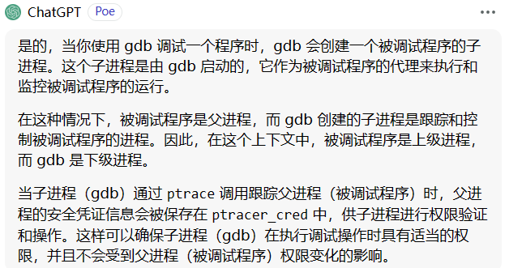
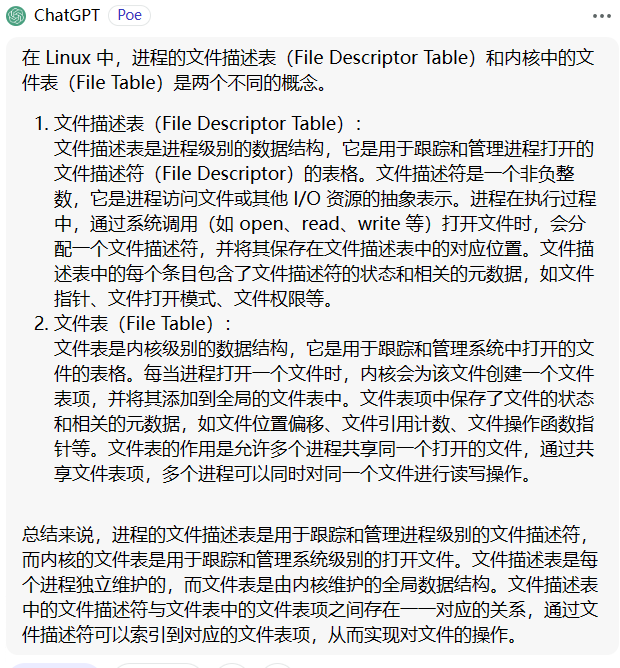

# Before ALL

本文是我学习Kernel时记下的笔记，其中大量借鉴了网上各位师傅的博客，若有侵权请联系我更改。

# Basic Knowledge

## kernel

kernel是一个用来管理软件发出的 I/O 要求，并把这些要求转义为指令交给CPU等处理的程序。kernel是现代操作系统中最基本的部分

kernel最重要的功能为以下两点：

1. 控制并与硬件进行交互
2. 提供application可以运行的程序

**注意：kernel的crash通常会引起程序的重启**

## 分级保护域

**分级保护域(hierarchical protection domains)** 又称为保护环，简称Rings，是一种将计算机的不同资源划分不同权限的模型

intel CPU 将 CPU 的特权级别分为 4 个级别：Ring 0, Ring 1, Ring 2, Ring 3。

Ring0只给OS时候用，Ring3所有程序都可以使用，现代计算机系统大部分都只使用了RIng0和Ring3

## Loadable Kernel Modules(LKMs)

可加载核心模块(或者直接称为内核模块)，是一个**运行在内核空间的可执行程序**。Linux Kernel采用的是宏内核架构，一切系统服务都由内核提供。效率高的同时缺乏的可拓展性以及可维护性。若提供新的服务可能需要需要重新编译整个内核，这个工作量是巨大的。所以 **LKMs** 应运而生。它就如同一个插件被装载入内核/从内核中移除。通过LKMS提高了内核的可拓展性以及可维护性。

LKMS与用户态的可执行文件一样，均为ELF格式，**但是LKMs必须运行在内核空间内，无法脱离内核运行**，他在运行的时候被链接到内核，作为内核的一部分。

和LKMs有关的如下：

1. **lsmod** ：列出现有的LKMs
2. **insmod** : 装载新的LKMs(root)
3. **rmmod** : 删除LKMs(root)

**在CTF比赛中，大多是对LKMs进行攻击，并非直接对整个内核发起攻击**

## 系统调用： syscall

对于syscall我们并不陌生，在srop以及shellcode中我们经常利用到，这是一个系统调用命令，指的是用户空间的程序向操作系统的内核请求更高权限的服务，比如IO间的通信。系统调用提供了用户程序和操作系统之间的接口。部分库函数也是对系统调用(read和write)的封装
1. Linux 下进入系统调用有两种主要的方式：

- 32位：执行 int 0x80 汇编指令（80号中断）
- 64位：执行 syscall 汇编指令 / 执行 sysenter 汇编指令（only intel）

2.  接下来就是由用户态进入到内核态的流程
 Linux下的系统调用以eax/rax寄存器作为系统调用号，参数传递约束如下：

- 32 位：ebx、ecx、edx、esi、edi、ebp作为第一个参数、第二个参数…进行参数传递
- 64 位：rdi、rsi、rdx、rcx、r8、r9作为第一个参数、第二个参数…进行参数传递

3. 同样地，内核执行完系统调用后退出系统调用也有对应的两种方式：

- 执行iret汇编指令
- 执行 sysret 汇编指令 / 执行sysexit汇编指令（only Intel）
- 接下来就是由内核态回退至用户态的流程

## 状态切换

### 用户态到内核态

当发生 `系统调用`，`产生异常`，`外设产生中断`时，会发生用户态到内核态的切换，大概过程为：

1. 通过 **swapgs** 切换gs段寄存器，将gs寄存器的值和一个特定位置的值进行交换，保存gs值同时将该位置的值作为内核执行时的gs值使用

2. 讲当前栈顶记录在CPU的独占变量区域，将CPU的独占变量区域中的内容放入rsp

3. 通过push保存各个寄存器的值

   ```c
    ENTRY(entry_SYSCALL_64)
    /* SWAPGS_UNSAFE_STACK是一个宏，x86直接定义为swapgs指令 */
    SWAPGS_UNSAFE_STACK
   
    /* 保存栈值，并设置内核栈 */
    movq %rsp, PER_CPU_VAR(rsp_scratch)
    movq PER_CPU_VAR(cpu_current_top_of_stack), %rsp
   
   
   /* 通过push保存寄存器值，形成一个pt_regs结构 */
   /* Construct struct pt_regs on stack */
   pushq  $__USER_DS      /* pt_regs->ss */
   pushq  PER_CPU_VAR(rsp_scratch)  /* pt_regs->sp */
   pushq  %r11             /* pt_regs->flags */
   pushq  $__USER_CS      /* pt_regs->cs */
   pushq  %rcx             /* pt_regs->ip */
   pushq  %rax             /* pt_regs->orig_ax */
   pushq  %rdi             /* pt_regs->di */
   pushq  %rsi             /* pt_regs->si */
   pushq  %rdx             /* pt_regs->dx */
   pushq  %rcx tuichu    /* pt_regs->cx */
   pushq  $-ENOSYS        /* pt_regs->ax */
   pushq  %r8              /* pt_regs->r8 */
   pushq  %r9              /* pt_regs->r9 */
   pushq  %r10             /* pt_regs->r10 */
   pushq  %r11             /* pt_regs->r11 */
   sub $(6*8), %rsp      /* pt_regs->bp, bx, r12-15 not saved */
   ```

4. 通过汇编指令判断架构（32/64）

5. 通过系统调用号，调到全局变量 `sys_call_table` 相应位置继续执行系统调用

### 内核态到用户态

从内核态退出到用户态的时候，流程如下：

1. 通过 `swapgs` 恢复 GS 值
2. 通过 `sysretq` 或者 `iretq` 恢复到用户控件继续执行。如果使用 `iretq` 还需要给出用户空间的一些信息（CS, eflags/rflags, esp/rsp 等）

## 进程权限管理

## 进程描述符

在内核中使用结构体 `task_struct` 表示一个进程


（文字和方框有点没对齐，凑合着看看得了）

我们主要关心的是其对于进程权限的管理

注意 `task_struct` 中如下的代码

```c
/* Process credentials: */

/* Tracer's credentials at attach: */
const struct cred __rcu        *ptracer_cred;

/* Objective and real subjective task credentials (COW): */
const struct cred __rcu        *real_cred;

/* Effective (overridable) subjective task credentials (COW): */
const struct cred __rcu        *cred;
```

**rocess credentials** 是 kernel 用以判断一个进程权限的凭证，在 kernel 中使用 `cred` 结构体进行标识，对于一个进程而言应当有三个 cred：

- **ptracer_cred：**使用`ptrace`系统调用跟踪该进程的上级进程的cred（gdb调试便是使用了这个系统调用，常见的反调试机制的原理便是提前占用了这个位置）
- **real_cred：**即**客体凭证**（**objective cred**），通常是一个进程最初启动时所具有的权限
- **cred：**即**主体凭证**（**subjective cred**），该进程的有效cred，kernel以此作为进程权限的凭证

一般情况下，主体凭证与客体凭证的值是相同的

> 例：当进程 A 向进程 B 发送消息时，A为主体，B为客体

关于这个 ptracer _cred 我不是很理解 然后



好好好这下理解了，gdb会创建一个被调试程序的子进程，这个进程是由gdb启动的，父进程是被调试的进程，gdb通过ptracer系统调用来跟踪父进程。父进程的安全凭证信息会被保存在ptracer _cred中，这样可以保证进程的权限正常

## 进程权限凭证

对于一个进程 使用 **cred** 结构体来管理权限，结构体的定义如下

```c
struct cred {
    atomic_t    usage;
#ifdef CONFIG_DEBUG_CREDENTIALS
    atomic_t    subscribers;    /* number of processes subscribed */
    void        *put_addr;
    unsigned    magic;
#define CRED_MAGIC    0x43736564
#define CRED_MAGIC_DEAD    0x44656144
#endif
    kuid_t        uid;        /* real UID of the task */
    kgid_t        gid;        /* real GID of the task */
    kuid_t        suid;        /* saved UID of the task */
    kgid_t        sgid;        /* saved GID of the task */
    kuid_t        euid;        /* effective UID of the task */
    kgid_t        egid;        /* effective GID of the task */
    kuid_t        fsuid;        /* UID for VFS ops */
    kgid_t        fsgid;        /* GID for VFS ops */
    unsigned    securebits;    /* SUID-less security management */
    kernel_cap_t    cap_inheritable; /* caps our children can inherit */
    kernel_cap_t    cap_permitted;    /* caps we're permitted */
    kernel_cap_t    cap_effective;    /* caps we can actually use */
    kernel_cap_t    cap_bset;    /* capability bounding set */
    kernel_cap_t    cap_ambient;    /* Ambient capability set */
#ifdef CONFIG_KEYS
    unsigned char    jit_keyring;    /* default keyring to attach requested
                     * keys to */
    struct key    *session_keyring; /* keyring inherited over fork */
    struct key    *process_keyring; /* keyring private to this process */
    struct key    *thread_keyring; /* keyring private to this thread */
    struct key    *request_key_auth; /* assumed request_key authority */
#endif
#ifdef CONFIG_SECURITY
    void        *security;    /* subjective LSM security */
#endif
    struct user_struct *user;    /* real user ID subscription */
    struct user_namespace *user_ns; /* user_ns the caps and keyrings are relative to. */
    struct group_info *group_info;    /* supplementary groups for euid/fsgid */
    /* RCU deletion */
    union {
        int non_rcu;            /* Can we skip RCU deletion? */
        struct rcu_head    rcu;        /* RCU deletion hook */
    };
} __randomize_layout;
```

我们关注的主要是该结构体中管理权限的变量

### 进程权限改变：

既然进程是由cred结构体管理的，我们很容易想到对cred结构体发起攻击从而获得root权限

内核空间内有如下两个函数

- `struct cred* prepare_kernel_cred(struct task_struct* daemon)`：该函数用以拷贝一个进程的cred结构体，并返回一个新的cred结构体，需要注意的是`daemon`参数应为**有效的进程描述符地址或NULL**
- `int commit_creds(struct cred *new)`：该函数用以将一个新的`cred`结构体应用到进程

查看 `prepare_kernel_cred()` 函数的源码

```c
struct cred *prepare_kernel_cred(struct task_struct *daemon)
{
    const struct cred *old;
    struct cred *new;

    new = kmem_cache_alloc(cred_jar, GFP_KERNEL);
    if (!new)
        return NULL;

    kdebug("prepare_kernel_cred() alloc %p", new);

    if (daemon)
        old = get_task_cred(daemon);
    else
        old = get_cred(&init_cred);
...
```

可以看到，在这个函数中，则会缺省使用`init`进程的`cred`作为模板进行拷贝，**即可以直接获得一个标识着root权限的cred结构体** 

如此，我们便可以想到，只需要执行 `commit_creds(prepare_kernel_cred(NULL))` ，我们就可以把进程的权限提升到root

## 用户ID & 组ID

一个cred结构体中记载了**一个进程四种不同的用户ID**：

- **真实用户ID**（real UID）：标识一个进程**启动时的用户ID**
- **保存用户ID**（saved UID）：标识一个进程**最初的有效用户ID**
- **有效用户ID**（effective UID）：标识一个进程**正在运行时所属的用户ID**，一个进程在运行途中是可以改变自己所属用户的，因而权限机制也是通过有效用户ID进行认证的，内核通过 euid 来进行特权判断；为了防止用户一直使用高权限，当任务完成之后，euid 会与 suid 进行交换，恢复进程的有效权限
- **文件系统用户ID**（UID for VFS ops）：标识一个进程**创建文件时进行标识的用户ID**

在通常情况下这几个ID应当都是相同的

用户组ID同样分为四个：`真实组ID`、`保存组ID`、`有效组ID`、`文件系统组ID`，与用户ID是类似的，这里便不再赘叙

## I/O

### 万物皆文件

在Linux系统的视角下，一切都可以被抽象成文件，都可以通过使用访问文件的方式进行操作。通过这种高层次的抽象统一性，提供了操作的一致性：

- 所有的读取操作都可以通过read
- 所有的更改操作都可以通过write进行

### 进程文件系统

进程文件系统（process file system， 简写为procfs）用以描述一个进程，其中包括该进程所打开的文件描述符、堆栈内存布局、环境变量等等

进程文件系统本身是一个伪文件系统，通常被挂载到`/proc`目录下，并不真正占用储存空间，而是占用一定的内存

当一个进程被建立起来时，其进程文件系统便会被挂载到`/proc/[PID]`下，我们可以在该目录下查看其相关信息

### 文件描述符

在之前的pwn的学习中，我们已经了解过一些文件描述符了，尤其是在IO FILE利用部分

进程通过文件描述符来完成对文件的访问。每个进程独立的有一个文件描述符表，存放着该进程所打开的文件索引。每当进程成功打开一个文件时，就会把他加到文件描述符的链表里面。

在kernel中有一个文件表，由所有的进程共享



## 系统调用：ioctl

在*NIX中一切都可以被视为文件，因而一切都可以以访问文件的方式进行操作，为了方便，Linux定义了系统调用`ioctl`供进程与设备之间进行通信

系统调用`ioctl`是一个专用于设备输入输出操作的一个系统调用，其调用方式如下：

```c
int ioctl(int fd, unsigned long request, ...)
```

对于一个提供了ioctl通信方式的设备而言，我们可以通过其文件描述符、使用不同的请求码及其他请求参数通过ioctl系统调用完成不同的对设备的I/O操作

## 内存分配

看不懂，以后再说

## 内核保护机制

### 通用保护机制

#### KASLR

和ASLR的作用相似，都是地址空间随机化。这是指内核镜像用射到的实际的地址空间时加上一个偏移值。但是内核内部的相对偏移还是不变的，在未开启KASLR保护机制的时候，内核段的基地址为 `0xffffffff81000000` ，direct mapping area 的基址为 `0xffff888000000000`

#### **FGKASLR*

KASLR 虽然在一定程度上能够缓解攻击，但是若是攻击者通过一些信息泄露漏洞获取到内核中的某个地址，仍能够直接得知内核加载地址偏移从而得知整个内核地址布局，因此有研究者基于 KASLR 实现了 FGKASLR，**以函数粒度重新排布内核代码**

#### STACK PROTECTOR

类似于用户态的canary保护，通常又被叫做 stack cookies，用来检测时候发送内核堆栈溢出，若是发生内核堆栈溢出会产生kernel panic

与用户态相似，内核的canary的值通常取自gs段寄存器的某个固定偏移的值

#### SMAP/SMEP

SMAP即 `管理模式保护访问` （Supervisor Mode Access Prevention），SMEP即`管理模式执行保护`（Supervisor Mode Execution Prevention），这两种保护通常是同时开启的，用来阻止 **内核空间直接访问/执行用户空间的数据** 通过这两种保护把内核空间和用户空间分隔开

SMAP绕过方法有如下两种

- 利用内核线性映射区对物理地址的完整映射，找到用户空间对应页框的内核空间地址。利用该内核地址完整对用户空间的访问，这种手法被叫做 `ret2dir` 
- Intel下根据 **CR4** 控制寄存器的第20位标识是否开启SMEP保护，若是通过 KernelROP改变该值，就可以关闭保护，从而进行 `ret2usr`  **但对于开启了 KPTI 的内核而言，内核页表的用户地址空间无执行权限，这使得 ret2usr 彻底成为过去式**

### 内核“堆”上保护机制

more details [这里](https://duasynt.com/blog/linux-kernel-heap-feng-shui-2022)

