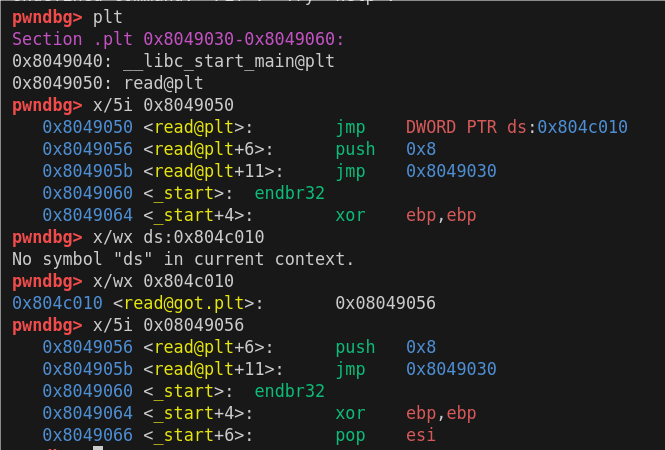
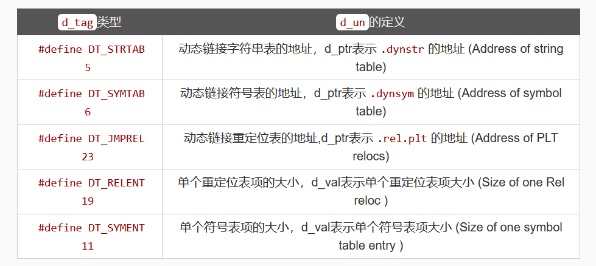
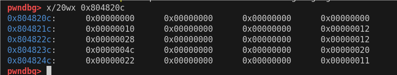

# ret2dlresolve

最近遇见了很多和linkmap相关的内容，之前一直觉得这种题目要么太简单可以用pwntools直接一把梭掉，要么太难没必要看，但是最近觉得还是要好好学习一下

参考文章：[ret2dl_resolve - 狒猩橙 - 博客园 (cnblogs.com)](https://www.cnblogs.com/pwnfeifei/p/15701859.html)

## i386

demo：

```c
// gcc -m32 -fno-stack-protector -no-pie -z relro -g -o demo demo.c
#include <stdio.h>
int main(){
    int data[20];
    read(stdin, data, 20);
    return 0;
}
```



发现第一次加载时的调用链 `read@plt --> read@got --> read@plt+6`

最终会调用 `_dl_runtime_resolve` 中的 `_dl_fixup` 函数

### 相关数据结构

```bash
c10uds@c10uds-virtual-machine:~/Desktop/tmp$ readelf -d demo

Dynamic section at offset 0x2f10 contains 24 entries:
  Tag        Type                         Name/Value
 0x00000001 (NEEDED)                     Shared library: [libc.so.6]
 0x0000000c (INIT)                       0x8049000
 0x0000000d (FINI)                       0x80491c4
 0x00000019 (INIT_ARRAY)                 0x804bf08
 0x0000001b (INIT_ARRAYSZ)               4 (bytes)
 0x0000001a (FINI_ARRAY)                 0x804bf0c
 0x0000001c (FINI_ARRAYSZ)               4 (bytes)
 0x6ffffef5 (GNU_HASH)                   0x80481ec
 0x00000005 (STRTAB)                     0x804826c
 0x00000006 (SYMTAB)                     0x804820c
 0x0000000a (STRSZ)                      91 (bytes)
 0x0000000b (SYMENT)                     16 (bytes)
 0x00000015 (DEBUG)                      0x0
 0x00000003 (PLTGOT)                     0x804c000
 0x00000002 (PLTRELSZ)                   16 (bytes)
 0x00000014 (PLTREL)                     REL
 0x00000017 (JMPREL)                     0x8048314
 0x00000011 (REL)                        0x8048304
 0x00000012 (RELSZ)                      16 (bytes)
 0x00000013 (RELENT)                     8 (bytes)
 0x6ffffffe (VERNEED)                    0x80482d4
 0x6fffffff (VERNEEDNUM)                 1
 0x6ffffff0 (VERSYM)                     0x80482c8
 0x00000000 (NULL)                       0x0
```

这里的每一个表项是用一个 `Elf32_Dyn` 结构体描述的，这个结构体的定义如下

```c
1 typedef struct {
2     Elf32_Sword     d_tag;
3     union {
4         Elf32_Word  d_val;
5         Elf32_Addr  d_ptr;
6     } d_un;
7 } Elf32_Dyn;
8 extern Elf32_Dyn_DYNAMIC[];
```

对于不同的类型,  `d_val/d_ptr` 有不同的含义，具体如下表



因此 我们可以从dynamic的信息获得 `.rel.plt & .dynsym & .dynstr` 的地址 

### .rep.plt

这个表中存放了重定向的有关信息，相关结构体定义如下

```c
typedef struct {
	Elf32_Addr        r_offset;
    Elf32_Word       r_info;
} Elf32_Rel;
```

`r_offset` 表示的是got表的地址，r_info的作用有两个：1. `r_info >> 8` 表示该函数对应在符号表.dynsym中的下标，`r_info&0xff `则表示重定位的类型。

```bash
c10uds@c10uds-virtual-machine:~/Desktop/tmp$ readelf -r demo

Relocation section '.rel.dyn' at offset 0x304 contains 2 entries:
 Offset     Info    Type            Sym.Value  Sym. Name
0804bff8  00000306 R_386_GLOB_DAT    00000000   __gmon_start__
0804bffc  00000406 R_386_GLOB_DAT    00000000   stdin@GLIBC_2.0

Relocation section '.rel.plt' at offset 0x314 contains 2 entries:
 Offset     Info    Type            Sym.Value  Sym. Name
0804c00c  00000107 R_386_JUMP_SLOT   00000000   __libc_start_main@GLIBC_2.34
0804c010  00000207 R_386_JUMP_SLOT   00000000   read@GLIBC_2.0
```

如上表，0x804c010为 r_offset ，在read被动态解析之后，会在这个地址填入真实地址，对于r_info, 计算可得 (r_info >> 8) == 2, 也就是说read对应的符号表在.dynsym中的第二个

### .dynsym&.dynstr

```bash
10uds@c10uds-virtual-machine:~/Desktop/tmp$ readelf -s demo

Symbol table '.dynsym' contains 6 entries:
   Num:    Value  Size Type    Bind   Vis      Ndx Name
     0: 00000000     0 NOTYPE  LOCAL  DEFAULT  UND 
     1: 00000000     0 FUNC    GLOBAL DEFAULT  UND _[...]@GLIBC_2.34 (2)
     2: 00000000     0 FUNC    GLOBAL DEFAULT  UND read@GLIBC_2.0 (3)
     3: 00000000     0 NOTYPE  WEAK   DEFAULT  UND __gmon_start__
     4: 00000000     0 OBJECT  GLOBAL DEFAULT  UND stdin@GLIBC_2.0 (3)
     5: 0804a004     4 OBJECT  GLOBAL DEFAULT   15 _IO_stdin_used

Symbol table '.symtab' contains 38 entries:
   Num:    Value  Size Type    Bind   Vis      Ndx Name
     0: 00000000     0 NOTYPE  LOCAL  DEFAULT  UND 
     1: 00000000     0 FILE    LOCAL  DEFAULT  ABS crt1.o
     2: 080481cc    32 OBJECT  LOCAL  DEFAULT    3 __abi_tag
     3: 00000000     0 FILE    LOCAL  DEFAULT  ABS crtstuff.c
     4: 080490c0     0 FUNC    LOCAL  DEFAULT   13 deregister_tm_clones
     5: 08049100     0 FUNC    LOCAL  DEFAULT   13 register_tm_clones
     6: 08049140     0 FUNC    LOCAL  DEFAULT   13 __do_global_dtors_aux
     7: 0804c01c     1 OBJECT  LOCAL  DEFAULT   24 completed.0
     8: 0804bf0c     0 OBJECT  LOCAL  DEFAULT   19 __do_global_dtor[...]
     9: 08049170     0 FUNC    LOCAL  DEFAULT   13 frame_dummy
    10: 0804bf08     0 OBJECT  LOCAL  DEFAULT   18 __frame_dummy_in[...]
    11: 00000000     0 FILE    LOCAL  DEFAULT  ABS demo.c
    12: 00000000     0 FILE    LOCAL  DEFAULT  ABS crtstuff.c
    13: 0804a0e8     0 OBJECT  LOCAL  DEFAULT   17 __FRAME_END__
    14: 00000000     0 FILE    LOCAL  DEFAULT  ABS 
    15: 0804bf10     0 OBJECT  LOCAL  DEFAULT   20 _DYNAMIC
    16: 0804a008     0 NOTYPE  LOCAL  DEFAULT   16 __GNU_EH_FRAME_HDR
    17: 0804c000     0 OBJECT  LOCAL  DEFAULT   22 _GLOBAL_OFFSET_TABLE_
    18: 00000000     0 FUNC    GLOBAL DEFAULT  UND __libc_start_mai[...]
    19: 00000000     0 FUNC    GLOBAL DEFAULT  UND read@GLIBC_2.0
    20: 080490b0     4 FUNC    GLOBAL HIDDEN    13 __x86.get_pc_thunk.bx
    21: 0804c014     0 NOTYPE  WEAK   DEFAULT   23 data_start
    22: 0804c01c     0 NOTYPE  GLOBAL DEFAULT   23 _edata
    23: 080491c4     0 FUNC    GLOBAL HIDDEN    14 _fini
    24: 0804c014     0 NOTYPE  GLOBAL DEFAULT   23 __data_start
    25: 00000000     0 NOTYPE  WEAK   DEFAULT  UND __gmon_start__
    26: 0804c018     0 OBJECT  GLOBAL HIDDEN    23 __dso_handle
    27: 0804a004     4 OBJECT  GLOBAL DEFAULT   15 _IO_stdin_used
    28: 00000000     0 OBJECT  GLOBAL DEFAULT  UND stdin@GLIBC_2.0
    29: 0804c020     0 NOTYPE  GLOBAL DEFAULT   24 _end
    30: 080490a0     5 FUNC    GLOBAL HIDDEN    13 _dl_relocate_sta[...]
    31: 08049060    49 FUNC    GLOBAL DEFAULT   13 _start
    32: 0804a000     4 OBJECT  GLOBAL DEFAULT   15 _fp_hw
    33: 0804c01c     0 NOTYPE  GLOBAL DEFAULT   24 __bss_start
    34: 08049176    71 FUNC    GLOBAL DEFAULT   13 main
    35: 080491bd     0 FUNC    GLOBAL HIDDEN    13 __x86.get_pc_thunk.ax
    36: 0804c01c     0 OBJECT  GLOBAL HIDDEN    23 __TMC_END__
    37: 08049000     0 FUNC    GLOBAL HIDDEN    11 _init
```

这里用到了Elf32_Sym结构体

```c
typedef struct {
    Elf32_Word    st_name;  // 符号名称的索引（在字符串表中的偏移量）
    Elf32_Addr    st_value; // 符号的值（地址）
    Elf32_Word    st_size;  // 符号的大小（字节数）
    unsigned char st_info;  // 符号的类型和绑定信息
    unsigned char st_other; // 符号的其他信息（通常为0）
    Elf32_Half    st_shndx; // 符号所在的节的索引
} Elf32_Sym;
```

可以发现 我们的read是表项中的第三个数据，我们去内存中看一下这个表



可以看到 st_name对应的值是0x28，就是说我们read对应的字符串在.dynstr中偏移为0x28的地方，由最开始的段为我们可以知道.dynstr的地址是0x804826c

```bash
pwndbg> x/s 0x804826c + 0x28
0x8048294:      "read"
```

### 总结调用过程

1. 第一次加载中，会调用read@plt，之后去调用read@got.plt，此时got中存放的是read@plt+6，跳到这里之后会运行 **`_dl_runtime_resolve`**

2. `_dl_runtime_resolve`函数靠link_map先找到dynamic，再通过dynamic段找到 .rel.plt的地址为 0x8048314，.dynsym的地址为 0x8048248， .dynstr的地址为 0x8048298。

3. `_dl_runtime_resolve`函数靠reloc_arg在.rel.plt里找到read的r_offset和r_info。

4. r_info>>8用来在 .dynsym找到read对应的st_name ,r_info&0xff用来做检查。

5. st_name用来在.dynstr里找到read所对应的字符串

6. 最后调用函数解析匹配read字符串所对应的函数地址，并将其填到r_offset（read的got表）里。